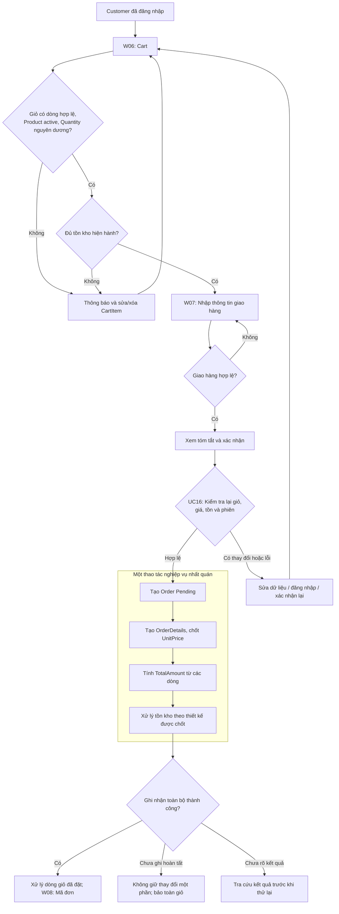
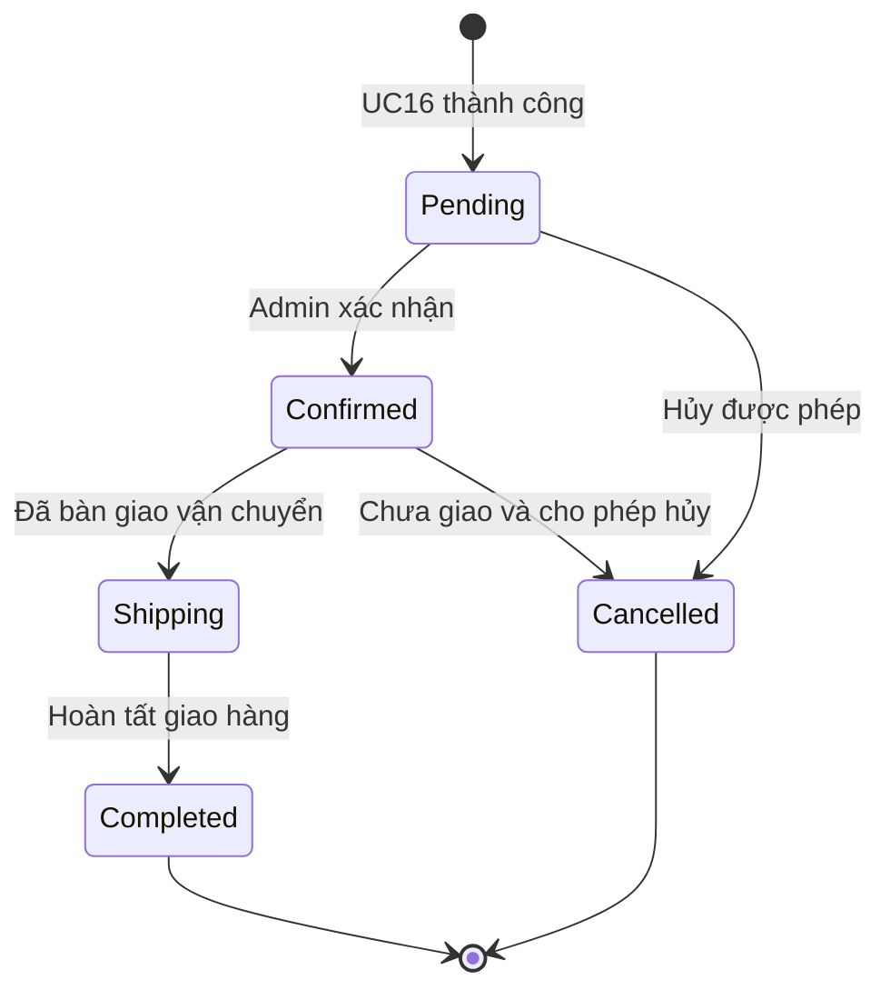
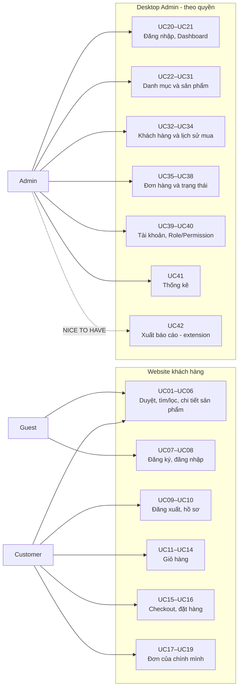

# S3 - Use Case và phân tích chức năng SportEquipmentStore

## 1. Cơ sở và phạm vi phân tích

Tài liệu tiếp nối [README](../README.md) và [S2 - Phân tích yêu cầu hệ thống](S2-System-Analysis.md) cho đề tài “Xây dựng hệ thống quản lý và bán dụng cụ thể thao”. Mục đích là mô tả hành vi, quyền truy cập, kết quả và tình huống lỗi trước khi thiết kế cơ sở dữ liệu.

Repository hiện có solution `SportEquipmentStore.sln` với bốn project: Web (ASP.NET Core MVC, .NET 9), Admin (Windows Forms, .NET 9 Windows), Core và Data (Class Library, .NET 9). Data tham chiếu Core; Web và Admin tham chiếu Core/Data. Web và Admin hiện là ứng dụng khung; các chức năng bên dưới là yêu cầu dự kiến, chưa phải tính năng đã triển khai.

S3 gồm **42 use case**, trong đó **10 use case có bảng đặc tả chi tiết**, **11 màn hình Web** và **12 màn hình Admin**. Mức ưu tiên kế thừa S2: MUST là cốt lõi, SHOULD là nên có, NICE TO HAVE là mở rộng. UC05 tách phần lọc danh mục MUST khỏi lọc nâng cao SHOULD; sắp xếp là phần bổ sung SHOULD theo yêu cầu S3. UC42 luôn là extension.

Các tên Product, CartItem, Order, OrderDetail, Account và Role chỉ dùng để diễn đạt khái niệm nghiệp vụ, không xác định entity, bảng, thuộc tính lưu trữ hoặc công nghệ triển khai. S3 giữ nguyên yêu cầu S2; các điểm chưa chốt được tập hợp tại mục 10.

## 2. Actors và trách nhiệm

| Actor | Trách nhiệm | Giới hạn |
|---|---|---|
| Guest | Xem trang chủ, danh mục, danh sách/chi tiết sản phẩm; tìm kiếm/lọc; đăng ký và đăng nhập Web. | Chưa được thao tác giỏ hàng của Customer, checkout hoặc xem dữ liệu riêng tư. Giỏ Guest còn là vấn đề mở của S2. |
| Customer | Kế thừa chức năng công khai của Guest; quản lý hồ sơ, giỏ hàng; checkout, đặt hàng và theo dõi đơn của mình. | Không xem/sửa dữ liệu người khác, tự gán Role hoặc chuyển trạng thái xử lý đơn. Yêu cầu hủy đơn chỉ là SHOULD, phụ thuộc chính sách. |
| Admin | Đăng nhập Desktop, quản lý danh mục/sản phẩm/khách hàng/đơn/tài khoản/quyền; xem dashboard, thống kê và báo cáo mở rộng. | Mỗi thao tác cần quyền phù hợp. Quyền Admin không tự động mang lại quyền mua hàng dưới danh nghĩa Customer. |

Guest thể hiện trạng thái chưa đăng nhập. Người quản trị dùng UC20 để thiết lập phiên Admin; UC08 dành cho phiên Customer trên Web. Customer đang đăng nhập được chuyển về nội dung phù hợp khi mở Login/Register, không tạo phiên lồng nhau. Admin vẫn có thể duyệt website công khai với tư cách người truy cập, nhưng đó không phải quyền quản trị.

## 3. Danh mục Use Case

### 3.1. Web: UC01–UC19

| ID | Tên | Actor | Priority | Hành vi chính và kết quả/ngoại lệ cần xử lý |
|---|---|---|---|---|
| UC01 | Xem trang chủ | Guest, Customer | MUST | Mở Home để xem hero, danh mục và sản phẩm gợi ý hiển thị theo dữ liệu hiện có; dùng trạng thái rỗng nếu chưa có dữ liệu. |
| UC02 | Xem danh sách sản phẩm | Guest, Customer | MUST | Mở Products, xem tên/ảnh/giá/tình trạng sản phẩm active; danh sách rỗng không phải lỗi. Phân trang khi cần là SHOULD. |
| UC03 | Xem sản phẩm theo danh mục | Guest, Customer | MUST | Chọn danh mục active và nhận danh sách tương ứng; danh mục đã ẩn/không tồn tại không được lộ qua đường dẫn trực tiếp. |
| UC04 | Tìm kiếm sản phẩm | Guest, Customer | MUST | Nhập từ khóa, kiểm tra đầu vào rồi trả sản phẩm phù hợp; từ khóa rỗng trở về danh sách, không có kết quả thì hướng dẫn đổi từ khóa. |
| UC05 | Lọc/sắp xếp sản phẩm | Guest, Customer | MUST/SHOULD | Lọc danh mục là MUST; khoảng giá, tình trạng hàng và sắp xếp tên/giá là SHOULD. Có thể kết hợp từ khóa UC04; bộ lọc sai phải được báo, không tự áp dụng tùy tiện. |
| UC06 | Xem chi tiết sản phẩm | Guest, Customer | MUST | Mở sản phẩm để xem mô tả, ảnh, giá, danh mục, tồn kho; hàng hết kho không cho mua, hàng inactive/không tồn tại trả thông báo không còn khả dụng. |
| UC07 | Đăng ký | Guest | MUST | Nhập định danh, thông tin bắt buộc, mật khẩu/xác nhận; kiểm tra hợp lệ và duy nhất rồi tạo tài khoản Customer, bảo vệ mật khẩu (BR08, BR16). Không cho chọn Role Admin; dữ liệu sai/trùng không tạo tài khoản. |
| UC08 | Đăng nhập | Guest → Customer | MUST | Xác thực tài khoản active và thiết lập phiên Customer; sai thông tin/inactive không được đăng nhập. Xem mục 4.1. |
| UC09 | Đăng xuất | Customer | MUST | Chọn Đăng xuất tại header, kết thúc phiên hiện tại và trở về trạng thái Guest; phiên đã hết hạn được coi là đã đăng xuất. Không xóa lịch sử mua hàng. |
| UC10 | Quản lý hồ sơ | Customer | MUST | Xem/sửa trường hồ sơ được phép của chính mình, validation trước khi lưu; không cho sửa Role/trạng thái tài khoản. Lỗi lưu giữ dữ liệu đã nhập để sửa lại. |
| UC11 | Thêm sản phẩm vào giỏ | Customer | MUST | Kiểm tra sản phẩm active, lượng mua và tồn kho; thêm mới hoặc cộng vào dòng đã có, kiểm tra cả tổng lượng sau cộng. Xem mục 4.2. |
| UC12 | Xem giỏ hàng | Customer | MUST | Xem giỏ của mình với lượng mua, giá hiện hành, tạm tính; đánh dấu dòng hết hàng/inactive/đổi giá. Giỏ rỗng hướng về Products; chưa giữ hàng hay chốt giá. |
| UC13 | Cập nhật số lượng | Customer | MUST | Chọn dòng thuộc giỏ của mình, nhập số nguyên dương và kiểm tra tồn kho; lưu lượng mới rồi tính lại tạm tính. Không dùng số 0 để ngầm xóa; dùng UC14. |
| UC14 | Xóa sản phẩm khỏi giỏ | Customer | MUST | Xác nhận bỏ dòng đã chọn, tính lại giỏ; dòng đã được xóa ở phiên khác thì làm mới. Xóa hết dòng tạo trạng thái giỏ rỗng, không tác động tồn kho. |
| UC15 | Checkout | Customer | MUST | Kiểm tra giỏ và thông tin giao hàng, trình bày nội dung để Customer xác nhận; chưa tạo đơn hoặc trừ tồn kho. Xem mục 4.3. |
| UC16 | Đặt hàng | Customer | MUST | Nhận xác nhận, kiểm tra lại dữ liệu hiện hành, tạo đơn/chi tiết, chốt giá/tổng tiền và xử lý tồn kho nhất quán theo chính sách. Xem mục 4.4. |
| UC17 | Xem lịch sử đơn | Customer | MUST | Hiển thị đơn của người đang đăng nhập với mã, ngày, tổng tiền, trạng thái; chưa có đơn hiển thị trạng thái rỗng, không trả dữ liệu người khác. |
| UC18 | Xem chi tiết đơn | Customer | MUST | Kiểm tra chủ sở hữu, hiển thị chi tiết và giá đã mua; đơn không thuộc mình/không tồn tại không được tiết lộ. Nhánh yêu cầu hủy là SHOULD tại mục 6.3. |
| UC19 | Theo dõi trạng thái đơn | Customer | MUST | Mở/làm mới đơn của mình để xem trạng thái mới nhất và ý nghĩa; lỗi tải không được giả định trạng thái mới. Không bao gồm theo dõi vận đơn ngoài hệ thống. |

### 3.2. Admin: UC20–UC42

UC21–UC42 đều yêu cầu phiên Admin active và quyền phù hợp; việc mở được màn hình không thay thế kiểm tra quyền lúc đọc/ghi dữ liệu. Lỗi tải/lưu phải có thông báo, không để trạng thái thành công giả hoặc dữ liệu ghi dở dang.

| ID | Tên | Actor | Priority | Hành vi chính và kết quả/ngoại lệ cần xử lý |
|---|---|---|---|---|
| UC20 | Admin Login | Admin | MUST | Kiểm tra thông tin đăng nhập, active và quyền Desktop; thành công mở Dashboard, không đủ quyền thì không tạo phiên Admin. Xem mục 4.5. |
| UC21 | Xem Dashboard | Admin | MUST | Xem số sản phẩm, khách hàng, đơn và số đơn theo trạng thái; số liệu lấy từ dữ liệu dùng chung. Nếu tải lỗi hiển thị không khả dụng, không hiển thị số 0 như số liệu thật. |
| UC22 | Xem danh mục | Admin | MUST | Xem danh sách và trạng thái active/inactive; chọn bản ghi để thao tác theo quyền. Danh sách rỗng cho phép thêm mới nếu có quyền. |
| UC23 | Thêm danh mục | Admin | MUST | Nhập tên/thông tin cần thiết, validation rồi lưu; thiếu tên bị từ chối, trùng tên xử lý theo chính sách S2 còn mở. Thành công làm mới danh sách. |
| UC24 | Sửa danh mục | Admin | MUST | Chọn bản ghi, sửa trường được phép và lưu sau validation; bản ghi mất hoặc bị sửa đồng thời cần làm mới, không ghi đè âm thầm. |
| UC25 | Xóa/vô hiệu hóa danh mục | Admin | MUST | Xem ảnh hưởng và xác nhận; có sản phẩm liên quan thì bảo toàn liên kết, không xóa cứng. Khi chưa chốt chính sách sản phẩm thuộc danh mục ẩn, chặn thay đổi ảnh hưởng việc bán và yêu cầu xử lý sản phẩm trước. |
| UC26 | Tìm kiếm danh mục | Admin | MUST | Tìm theo tên, lọc active/inactive; xóa bộ lọc để xem lại toàn bộ trong phạm vi quyền. Không có kết quả là trạng thái rỗng. |
| UC27 | Xem sản phẩm | Admin | MUST | Xem cả sản phẩm active/inactive, giá, tồn kho, danh mục; mở form hoặc chọn thao tác. Không sửa trực tiếp dữ liệu nếu không có quyền. |
| UC28 | Thêm sản phẩm | Admin | MUST | Nhập thông tin, kiểm tra giá/tồn kho/danh mục rồi lưu; lỗi validation giữ form để sửa. Xem mục 4.6. |
| UC29 | Sửa sản phẩm | Admin | MUST | Sửa thông tin/giá/tồn kho hợp lệ; phát hiện xung đột khi Web hoặc Admin khác vừa cập nhật. Giá trong đơn đã đặt giữ nguyên. Xem mục 4.7. |
| UC30 | Xóa/vô hiệu hóa sản phẩm | Admin | MUST | Kiểm tra tham chiếu và ảnh hưởng, ưu tiên inactive; không xóa sản phẩm đã có giao dịch. Xem mục 4.8. |
| UC31 | Tìm kiếm/lọc sản phẩm | Admin | MUST | Tìm tên/mã nếu có, lọc danh mục và trạng thái; kết hợp điều kiện hợp lệ, hỗ trợ làm mới/xóa lọc. |
| UC32 | Xem khách hàng | Admin | MUST | Xem thông tin cần thiết và trạng thái tài khoản; mở chi tiết theo quyền, không hiển thị mật khẩu hoặc hash. |
| UC33 | Tìm kiếm khách hàng | Admin | MUST | Tìm theo tên/email/số điện thoại phù hợp và lọc trạng thái; không có kết quả thì giữ điều kiện để sửa. |
| UC34 | Xem lịch sử mua của khách | Admin | MUST | Chọn khách hàng, xem các đơn tương ứng và mở UC37; không có giao dịch hiển thị rõ. Không sửa hồ sơ hoặc đơn qua thao tác đọc này. |
| UC35 | Xem đơn hàng | Admin | MUST | Xem mã đơn, khách hàng, ngày, tổng tiền và trạng thái; chọn đơn để xem chi tiết. |
| UC36 | Tìm kiếm/lọc đơn | Admin | MUST | Tìm theo mã/khách hàng, lọc thời gian và trạng thái; khoảng ngày đảo ngược phải được sửa trước khi áp dụng. |
| UC37 | Xem chi tiết đơn | Admin | MUST | Xem thông tin giao hàng, OrderDetails, UnitPrice lịch sử, TotalAmount và trạng thái. Xem mục 4.9. |
| UC38 | Cập nhật trạng thái đơn | Admin | MUST | Kiểm tra chuyển trạng thái, quyền và điều kiện thực tế; cập nhật nhất quán với ảnh hưởng tồn kho nếu có. Xem mục 4.10. |
| UC39 | Quản lý tài khoản | Admin | MUST | Xem/tìm tài khoản, thêm tài khoản quản trị, cập nhật trường được phép và khóa/mở theo quyền; cập nhật thông tin/trạng thái Customer liên kết từ A08 cũng thuộc UC này. Định danh phải unique, không lộ mật khẩu; không xóa khách đã có đơn. Chính sách bảo vệ Admin cuối cùng cần chốt. |
| UC40 | Quản lý Role/Permission ở mức phù hợp | Admin | MUST | Xem/gán vai trò hợp lệ và kiểm tra quyền trước khi lưu; mức nền là Customer/Admin. Cấu hình Permission chi tiết chỉ xét khi có nhu cầu đã chốt, không bắt buộc có trình thiết kế quyền động. |
| UC41 | Xem thống kê | Admin | MUST/SHOULD | Xem tổng hợp cơ bản là MUST; lọc theo khoảng thời gian là SHOULD. Tổng doanh thu phải ghi rõ tập trạng thái/tiêu chí tính đã chốt, phân biệt lỗi tải với không có dữ liệu. |
| UC42 | Xuất báo cáo (extension) | Admin | NICE TO HAVE | Từ kết quả thống kê/báo cáo, chọn phạm vi và định dạng đã hỗ trợ để xuất; có thể hủy chọn nơi lưu. Lỗi xuất không thay đổi dữ liệu nghiệp vụ; không cần chức năng này để hoàn thành cốt lõi. |

## 4. Đặc tả chi tiết Use Case trọng tâm

Alternative Flow mô tả nhánh nghiệp vụ dự kiến, gồm validation bị từ chối; Exception Flow mô tả sự cố kỹ thuật, phiên/quyền thay đổi hoặc dữ liệu bị thay đổi đồng thời. Postconditions nêu cả kết quả thành công và bảo đảm khi thất bại. Các Main Flow dưới đây là thứ tự xử lý logic, không phải thiết kế lưu trữ.

### 4.1. UC08 - Đăng nhập

| Trường | Đặc tả |
|---|---|
| Use Case ID | UC08 |
| Tên | Đăng nhập Web |
| Actor | Guest, trở thành Customer sau khi xác thực hợp lệ. |
| Mục tiêu | Cho phép khách hàng sử dụng chức năng cá nhân với đúng danh tính. |
| Preconditions | Người dùng mở W04; chưa có phiên Customer hợp lệ. Tài khoản và cơ chế xác thực sẽ có ở giai đoạn triển khai. |
| Trigger | Người dùng gửi form Đăng nhập. |
| Main Flow | 1. Nhập định danh và mật khẩu. 2. Hệ thống kiểm tra trường bắt buộc/định dạng. 3. Kiểm tra thông tin xác thực bằng cơ chế password hash, trạng thái active và quyền Customer. 4. Thiết lập phiên gắn với tài khoản đã xác thực. 5. Chuyển đến trang Web phù hợp hoặc đích nội bộ hợp lệ đã yêu cầu trước đăng nhập. |
| Alternative Flow | A1. Thiếu/sai định dạng: báo tại trường, cho sửa. A2. Sai thông tin, inactive hoặc không có quyền Customer: từ chối bằng thông báo an toàn, không tạo phiên. A3. Đã đăng nhập: đưa về trang phù hợp, không tạo phiên thứ hai. |
| Exception Flow | E1. Không truy cập được dữ liệu/xác thực: thông báo tạm thời, ghi nhận lỗi không chứa mật khẩu và không tạo phiên. E2. Tài khoản bị vô hiệu hóa trong quá trình xử lý: từ chối truy cập, yêu cầu kiểm tra lại. |
| Postconditions | Thành công: phiên Customer hợp lệ, không cấp quyền Admin. Thất bại: không có phiên mới; mật khẩu không được lưu/ghi log dạng rõ. BR08, BR10, BR14, BR16 được giữ. |

### 4.2. UC11 - Thêm sản phẩm vào giỏ

| Trường | Đặc tả |
|---|---|
| Use Case ID | UC11 |
| Tên | Thêm sản phẩm vào giỏ (Add To Cart) |
| Actor | Customer |
| Mục tiêu | Ghi nhận mặt hàng và lượng mua dự kiến vào giỏ của mình. |
| Preconditions | Phiên Customer hợp lệ; đang xem sản phẩm tại W01/W02/W03 và có thể xác định sản phẩm được chọn. |
| Trigger | Chọn Thêm vào giỏ với số lượng mong muốn. |
| Main Flow | 1. Kiểm tra danh tính và quyền sở hữu giỏ. 2. Kiểm tra sản phẩm còn tồn tại và active. 3. Kiểm tra số lượng là số nguyên dương. 4. Nếu có dòng cùng sản phẩm, tính lượng sau cộng; nếu chưa có, dùng lượng mới. 5. Kiểm tra lượng kết quả không vượt tồn kho hiện hành. 6. Cập nhật giỏ và tạm tính, thông báo thành công/cập nhật chỉ báo giỏ. |
| Alternative Flow | A1. Guest bấm mua: chuyển W04, chưa thêm vào giỏ Customer; sau đăng nhập kiểm tra lại yêu cầu. A2. Quantity sai hoặc tổng sau cộng vượt tồn kho: báo lượng khả dụng, giữ giỏ cũ. A3. Product inactive/không còn tồn tại/hết hàng: báo không thể mua, không thêm. A4. Dòng đã có được cộng số lượng theo bước 4 thay vì tạo hai dòng cùng sản phẩm. |
| Exception Flow | E1. Phiên hết hạn: yêu cầu đăng nhập lại, không sửa giỏ người khác. E2. Lỗi lưu hoặc giỏ bị cập nhật đồng thời: báo lỗi/làm mới để người dùng xác nhận lại, không báo thành công khi chưa lưu. |
| Postconditions | Thành công: giỏ của Customer có lượng hợp lệ tại thời điểm kiểm tra. Giỏ không giữ hàng/chốt giá; tồn kho không bị trừ. Thất bại: không áp dụng thay đổi không hợp lệ. BR03, BR04, BR11, BR14 được giữ; UC16 vẫn phải kiểm tra lại. |

### 4.3. UC15 - Checkout

| Trường | Đặc tả |
|---|---|
| Use Case ID | UC15 |
| Tên | Checkout - Kiểm tra giỏ và thông tin giao hàng |
| Actor | Customer |
| Mục tiêu | Chuẩn bị nội dung mua hàng hợp lệ để Customer xem và xác nhận. |
| Preconditions | Customer có phiên hợp lệ, truy cập giỏ của mình; giỏ cần có ít nhất một mặt hàng để đi tiếp. Nếu điều kiện này không còn đúng thì xử lý nhánh A1. |
| Trigger | Chọn Tiến hành checkout từ W06. |
| Main Flow | 1. Đọc giỏ của Customer, kiểm tra không rỗng. 2. Kiểm tra CartItem, Quantity, Product active và tồn kho hiện hành. 3. Hiển thị W07 với hàng hóa, giá hiện hành và tạm tính. 4. Customer nhập/xác nhận tên người nhận, số điện thoại và địa chỉ; bộ trường chi tiết còn phải chốt. 5. Validation dữ liệu giao hàng. 6. Hiển thị bản tóm tắt để Customer xác nhận và cho phép gửi UC16. |
| Alternative Flow | A1. Giỏ trống: về W06, hướng dẫn chọn sản phẩm. A2. Sản phẩm inactive/thiếu hàng/số lượng sai: đánh dấu dòng lỗi, yêu cầu sửa/xóa qua UC13/UC14, chặn đặt hàng. A3. Dữ liệu giao hàng sai: giữ thông tin hợp lệ, báo trường cần sửa. A4. Giá đã đổi: cập nhật bản tóm tắt và yêu cầu xác nhận theo giá mới. A5. Customer quay lại giỏ: không phát sinh đơn. |
| Exception Flow | E1. Phiên hết hạn hoặc không có quyền đọc giỏ: dừng và yêu cầu đăng nhập. E2. Lỗi tải dữ liệu: thông báo thử lại, không coi giá/tồn kho cũ là đã xác nhận. |
| Postconditions | Thành công: Customer có bản tóm tắt hợp lệ để xác nhận tại thời điểm kiểm tra. Chưa tạo Order/OrderDetails, chưa trừ hoặc giữ tồn kho. Thất bại: không tạo đơn, giỏ không bị xóa. BR03–BR05, BR11, BR14 là điều kiện đi tiếp. |

### 4.4. UC16 - Đặt hàng

| Trường | Đặc tả |
|---|---|
| Use Case ID | UC16 |
| Tên | Đặt hàng (Place Order) |
| Actor | Customer |
| Mục tiêu | Ghi nhận đúng một đơn cho một lần xác nhận hợp lệ, bảo toàn tiền và tồn kho. |
| Preconditions | Phiên Customer hợp lệ; đã qua UC15 và đang xem tóm tắt tại W07. Các dữ liệu phải được kiểm tra lại lúc gửi vì có thể đã thay đổi. |
| Trigger | Customer bấm Xác nhận đặt hàng. |
| Main Flow | 1. Kiểm tra danh tính, quyền sở hữu giỏ và lần gửi xác nhận. 2. Đọc lại giỏ/sản phẩm hiện hành; kiểm tra giỏ không rỗng, active, số nguyên dương, đủ tồn kho và dữ liệu giao hàng hợp lệ. 3. Đối chiếu giá/nội dung đã xác nhận; nếu thay đổi cần quay lại xác nhận. 4. Tạo Order của Customer ở Pending cùng thông tin giao hàng đã xác nhận. 5. Tạo ít nhất một OrderDetail, chốt Quantity và UnitPrice tại thời điểm mua. 6. Tính TotalAmount từ tổng Quantity × UnitPrice của các dòng, không lấy tổng do client tự gửi. 7. Áp dụng xử lý tồn kho theo chính sách thiết kế được chốt, bảo đảm không bán vượt tồn và nhất quán với việc tạo đơn. 8. Ghi nhận toàn bộ thao tác thành công; xử lý các dòng giỏ đã đặt theo chính sách, không làm mất mặt hàng mới thêm ở phiên khác. 9. Trả mã đơn, đưa đến W08 và cho phép mở W10. |
| Alternative Flow | A1. Giỏ rỗng, inactive, thiếu hàng, Quantity/giao hàng sai: chặn tạo đơn, chỉ rõ nguyên nhân và quay về W06/W07. A2. Giá/nội dung thay đổi: hiển thị lại để xác nhận, không âm thầm chốt mức giá khác. A3. Gửi lặp cùng lần xác nhận đã thành công: trả kết quả đơn trước đó, không tạo thêm đơn hoặc trừ tồn lần nữa. |
| Exception Flow | E1. Có người khác mua hết hàng hoặc Admin vừa chỉnh tồn/trạng thái: từ chối thao tác không còn hợp lệ, tải lại để xử lý. E2. Ghi dữ liệu thất bại trước khi hoàn tất: không để đơn/chi tiết/tồn kho dở dang, không xóa giỏ. E3. Mất phản hồi sau khi có thể đã ghi thành công: kiểm tra kết quả lần đặt trước/lịch sử đơn trước khi thử lại; không giả định đơn chưa tồn tại. E4. Phiên hết hạn: dừng yêu cầu, không tạo đơn cho danh tính khác. |
| Postconditions | Thành công: có một Order Pending với ít nhất một OrderDetail, UnitPrice lịch sử đúng, TotalAmount đúng và tồn kho nhất quán. Thất bại trước khi ghi hoàn tất: không có thay đổi nghiệp vụ một phần; trường hợp chưa rõ kết quả phải tra cứu. BR01–BR07, BR10–BR14 được áp dụng. |

### 4.5. UC20 - Admin Login

| Trường | Đặc tả |
|---|---|
| Use Case ID | UC20 |
| Tên | Đăng nhập ứng dụng Admin |
| Actor | Admin (người quản trị chưa có phiên Desktop hợp lệ) |
| Mục tiêu | Chỉ cho người có tài khoản active và quyền Admin truy cập quản trị. |
| Preconditions | Ứng dụng Desktop mở tại A01; chưa có phiên Admin hợp lệ. |
| Trigger | Gửi thông tin đăng nhập tại A01. |
| Main Flow | 1. Nhập định danh và mật khẩu. 2. Kiểm tra đầu vào. 3. Xác minh mật khẩu và active. 4. Kiểm tra Role/Permission cho ứng dụng quản trị. 5. Thiết lập phiên với quyền tương ứng, mở A02 và menu phù hợp. |
| Alternative Flow | A1. Thiếu thông tin: yêu cầu bổ sung. A2. Thông tin sai/inactive: từ chối an toàn. A3. Tài khoản chỉ là Customer: không cấp phiên hoặc quyền Admin dù mật khẩu đúng. |
| Exception Flow | E1. Nguồn dữ liệu/xác thực không khả dụng: báo lỗi, ở lại A01. E2. Trạng thái/quyền vừa bị thu hồi: không mở chức năng trái quyền; phiên hiện có xử lý theo chính sách cần chốt ở S2. |
| Postconditions | Thành công: phiên Admin và tập quyền hợp lệ. Thất bại: không truy cập dữ liệu quản trị. Quyền tiếp tục được kiểm tra ở các thao tác sau; không chỉ tại Login. BR09, BR10, BR16 được giữ. |

### 4.6. UC28 - Thêm sản phẩm

| Trường | Đặc tả |
|---|---|
| Use Case ID | UC28 |
| Tên | Thêm sản phẩm (Add Product) |
| Actor | Admin có quyền thêm sản phẩm |
| Mục tiêu | Bổ sung sản phẩm hợp lệ vào danh mục hàng hóa. |
| Preconditions | Phiên Admin hợp lệ; có quyền thêm; mở A05 và có danh mục hợp lệ để chọn. |
| Trigger | Chọn Thêm sản phẩm để mở A06. |
| Main Flow | 1. Mở form thêm mới. 2. Nhập tên, danh mục, giá, tồn kho, mô tả/ảnh nếu có và trạng thái. 3. Hệ thống kiểm tra trường bắt buộc, Price >= 0, StockQuantity là số nguyên >= 0 và danh mục hợp lệ. 4. Kiểm tra lại quyền/danh mục trước lưu. 5. Lưu sản phẩm, báo thành công và làm mới A05. |
| Alternative Flow | A1. Thiếu/sai dữ liệu: chỉ rõ lỗi và giữ form để sửa. A2. Không có danh mục phù hợp: dừng lưu; có thể dùng UC23 nếu được cấp quyền rồi quay lại. A3. Admin hủy form: không tạo sản phẩm. A4. Ảnh không hợp lệ theo chính sách được chốt: yêu cầu sửa, không lưu nguồn ảnh không được chấp nhận. |
| Exception Flow | E1. Lỗi lưu/đọc danh mục: báo thử lại, không để bản ghi một phần. E2. Quyền bị thu hồi/danh mục vừa bị vô hiệu hóa: dừng lưu và yêu cầu làm mới. |
| Postconditions | Thành công: sản phẩm mới có dữ liệu hợp lệ và hiển thị theo trạng thái. Thất bại/hủy: không tạo sản phẩm. Giá/tồn kho bằng 0 vẫn thỏa BR01/BR02; tồn bằng 0 không cho đặt hàng. |

### 4.7. UC29 - Sửa sản phẩm

| Trường | Đặc tả |
|---|---|
| Use Case ID | UC29 |
| Tên | Sửa sản phẩm (Update Product) |
| Actor | Admin có quyền sửa sản phẩm |
| Mục tiêu | Cập nhật dữ liệu hiện hành và giữ nguyên lịch sử giao dịch. |
| Preconditions | Phiên/quyền Admin hợp lệ; sản phẩm được chọn tồn tại tại thời điểm mở A06. |
| Trigger | Chọn Sửa từ A05. |
| Main Flow | 1. Đọc dữ liệu sản phẩm hiện hành vào form. 2. Admin sửa trường được phép. 3. Kiểm tra tên/danh mục, Price >= 0 và tồn kho nguyên không âm. 4. Kiểm tra quyền và dữ liệu có thay đổi từ lúc mở form hay không. 5. Ghi thay đổi hợp lệ, giữ nguyên OrderDetails của các đơn đã đặt. 6. Làm mới danh sách/chi tiết và báo thành công. |
| Alternative Flow | A1. Dữ liệu sai: báo tại trường, giữ dữ liệu để sửa. A2. Không có thay đổi: đóng/làm mới, không cần ghi. A3. Admin hủy: giữ bản ghi cũ. A4. Đổi giá chỉ ảnh hưởng mua mới; giỏ chưa đặt cần kiểm tra giá lại. |
| Exception Flow | E1. Web vừa bán hàng hoặc Admin khác vừa sửa tồn kho: không ghi đè số tồn đã cũ; yêu cầu làm mới và xác nhận thay đổi phù hợp. E2. Sản phẩm bị xóa/danh mục không còn hợp lệ: không lưu mù, báo lỗi. E3. Lỗi lưu/phiên hoặc quyền hết hiệu lực: không áp dụng một phần thay đổi. |
| Postconditions | Thành công: dữ liệu hiện hành được cập nhật và lịch sử UnitPrice giữ nguyên. Thất bại: không ghi đè thay đổi của người khác hoặc làm âm tồn kho. BR01, BR02, BR06, BR09, BR15 được giữ. |

### 4.8. UC30 - Xóa/vô hiệu hóa sản phẩm

| Trường | Đặc tả |
|---|---|
| Use Case ID | UC30 |
| Tên | Xóa/vô hiệu hóa sản phẩm (Delete/Deactivate Product) |
| Actor | Admin có quyền tương ứng |
| Mục tiêu | Ngừng bán sản phẩm, bảo toàn tham chiếu và lịch sử. |
| Preconditions | Phiên/quyền hợp lệ; đã chọn sản phẩm tại A05. |
| Trigger | Chọn Xóa/Vô hiệu hóa. |
| Main Flow | 1. Đọc sản phẩm và kiểm tra tham chiếu/ảnh hưởng. 2. Hiển thị trạng thái hiện tại và tác động của việc ngừng bán. 3. Admin xác nhận vô hiệu hóa. 4. Kiểm tra lại quyền, trạng thái và tham chiếu hiện hành. 5. Đặt sản phẩm inactive, làm mới A05; chặn mua mới từ Web. |
| Alternative Flow | A1. Đã có OrderDetail: từ chối xóa cứng, chỉ cho ngừng bán. A2. Chưa có tham chiếu: xóa cứng chỉ được xem xét nếu chính sách được phê duyệt; mặc định dùng inactive, không coi xóa cứng là bắt buộc. A3. Đã inactive: thông báo trạng thái hiện tại. A4. Admin bỏ xác nhận: không thay đổi. A5. Sản phẩm đang có trong giỏ: khi checkout phải báo không khả dụng, Customer có thể xóa dòng; giỏ không phải lý do làm mất lịch sử đơn. |
| Exception Flow | E1. Phát sinh tham chiếu mới hoặc thay đổi đồng thời: kiểm tra lại, chặn xóa không an toàn. E2. Lỗi lưu/mất quyền: thông báo thất bại, không báo ngừng bán thành công khi chưa ghi. |
| Postconditions | Thành công: không thể mua mới sản phẩm inactive; đơn đã có vẫn hiển thị được giá/chi tiết lịch sử và không tự bị hủy. Thất bại/hủy: không thay đổi từ thao tác này. BR09, BR11, BR15 được giữ. |

### 4.9. UC37 - Xem chi tiết đơn

| Trường | Đặc tả |
|---|---|
| Use Case ID | UC37 |
| Tên | Xem chi tiết đơn (View Order Detail - Admin) |
| Actor | Admin có quyền xem đơn |
| Mục tiêu | Cung cấp thông tin tin cậy để quản trị viên kiểm tra và xử lý đơn. |
| Preconditions | Phiên/quyền Admin hợp lệ; có mã đơn được chọn từ A09 hoặc lịch sử khách tại A08. |
| Trigger | Mở chi tiết đơn. |
| Main Flow | 1. Kiểm tra quyền truy cập đơn. 2. Đọc thông tin đơn, người nhận, trạng thái và các OrderDetails tương ứng. 3. Hiển thị Quantity, UnitPrice đã chốt, thành tiền từng dòng và TotalAmount. 4. Hiển thị các thao tác trạng thái được phép theo quyền; thực hiện chúng qua UC38. |
| Alternative Flow | A1. Đơn không tồn tại/không có quyền: báo không thể truy cập, không lộ dữ liệu. A2. Product/Account liên quan hiện inactive: vẫn hiển thị thông tin giao dịch đã ghi nhận, không lấy giá hiện tại thay cho UnitPrice. A3. Admin làm mới: đọc lại trạng thái mới nhất. |
| Exception Flow | E1. Lỗi tải đơn/chi tiết: hiển thị lỗi, không thay dữ liệu thiếu bằng số 0 hoặc danh sách rỗng giả. E2. Phát hiện đơn rỗng hoặc tổng tiền không khớp: báo bất thường để xử lý, không tự sửa dữ liệu bằng thao tác xem. E3. Phiên hết hạn: không tiếp tục đọc dữ liệu quản trị. |
| Postconditions | Thành công: A10 hiển thị đầy đủ chi tiết lịch sử có quyền xem. Đây là thao tác chỉ đọc; không thay đổi đơn, tổng tiền hoặc tồn kho. UC18 trên Web phải kiểm tra thêm quyền sở hữu Customer theo BR14. |

### 4.10. UC38 - Cập nhật trạng thái đơn

| Trường | Đặc tả |
|---|---|
| Use Case ID | UC38 |
| Tên | Cập nhật trạng thái đơn (Update Order Status) |
| Actor | Admin có quyền xử lý đơn |
| Mục tiêu | Chuyển đơn theo tiến trình thực tế, đúng chính sách hủy và nhất quán tồn kho. |
| Preconditions | Phiên/quyền Admin hợp lệ; đã mở đơn tại A10. Điều kiện chuyển và tác động tồn kho phải được chính sách thiết kế làm rõ trước triển khai. |
| Trigger | Chọn trạng thái kế tiếp và xác nhận. |
| Main Flow | 1. Đọc lại đơn và trạng thái hiện hành. 2. Kiểm tra quyền và đối chiếu trạng thái được phép tại mục 6. 3. Admin xác nhận điều kiện thực tế: đã kiểm tra đơn, đã bàn giao vận chuyển hoặc đã hoàn tất giao hàng. 4. Hệ thống kiểm tra lần cuối trạng thái chưa bị thay đổi. 5. Ghi trạng thái mới và ảnh hưởng tồn kho nếu chính sách yêu cầu trong một thao tác nhất quán, không áp dụng lặp. 6. Làm mới A09/A10; Customer có thể thấy trạng thái mới qua UC19. |
| Alternative Flow | A1. Pending/Confirmed sang Cancelled: chỉ thực hiện khi được chính sách cho phép, chưa giao và người thao tác có quyền; nếu cần hoàn tồn thì chỉ hoàn phần đã xử lý trước đó. A2. Bỏ qua bước, chuyển ngược, hủy Shipping hoặc sửa đơn Completed/Cancelled: từ chối. A3. Yêu cầu cùng trạng thái đang có: không cập nhật/hoàn tồn lần nữa. A4. Bỏ xác nhận: không thay đổi. |
| Exception Flow | E1. Admin khác đã chuyển trạng thái: báo xung đột, tải lại, không ghi đè. E2. Lỗi ghi trạng thái hoặc tồn kho: không để hai phần lệch nhau. E3. Mất phản hồi sau ghi: kiểm tra trạng thái/kết quả trước khi thử lại. E4. Phiên/quyền bị thu hồi: dừng thao tác. |
| Postconditions | Thành công: đúng một chuyển trạng thái hợp lệ, tồn kho liên quan nhất quán; UnitPrice/Quantity/TotalAmount lịch sử không bị tùy ý sửa. Thất bại: không có thay đổi một phần. BR02, BR06, BR07, BR09, BR12, BR13, BR15 được giữ. |

## 5. Luồng checkout và đặt hàng xuyên suốt

### 5.1. Luồng chính

1. **Customer → Cart (W06, UC12):** đọc giỏ thuộc tài khoản đang đăng nhập; Customer có thể cập nhật/xóa dòng bằng UC13/UC14.
2. **Kiểm tra CartItem (UC15):** giỏ không rỗng; từng dòng có sản phẩm hợp lệ, active và Quantity là số nguyên lớn hơn 0.
3. **Kiểm tra tồn kho:** kiểm tra lượng mua của từng sản phẩm không vượt tồn hiện hành, kể cả lượng đã cộng vào dòng trước đó.
4. **Nhập thông tin giao hàng (W07):** nhập/xác nhận người nhận, số điện thoại, địa chỉ; validation theo bộ trường và định dạng được chốt sau.
5. **Xác nhận:** hiển thị hàng hóa, lượng mua, giá hiện hành, tạm tính và thông tin giao hàng. Customer xác nhận bằng hành động đặt hàng rõ ràng.
6. **Kiểm tra lại trước ghi (UC16):** kiểm tra phiên, giỏ, active, Quantity, tồn kho, giao hàng và giá tại thời điểm gửi. Nếu khác nội dung đã xác nhận, quay lại để Customer xác nhận mới.
7. **Tạo Order:** gắn với Customer, thông tin giao hàng đã xác nhận và trạng thái Pending.
8. **Tạo OrderDetails:** có ít nhất một dòng, lưu Quantity và UnitPrice tại thời điểm mua. Giá tham khảo ở giỏ không phải giá lịch sử của đơn.
9. **Tính TotalAmount:** tổng các thành tiền `Quantity × UnitPrice`. Theo BR07 hiện tại, không tự cộng phí giao hàng, khuyến mãi hay thuế vào công thức; nếu bổ sung sau phải phân tích riêng các khoản đó.
10. **Xử lý tồn kho theo thiết kế sau này:** bảo đảm việc ghi nhận đơn và ảnh hưởng tồn kho nhất quán, không bán vượt tồn. S2 mục 10.3 đặt xử lý tồn kho trong luồng tạo đơn nhưng mục 14 còn để mở thời điểm/cách trừ hoặc giữ hàng; S3 không tự chốt cơ chế vật lý.
11. **Hoàn thành đặt hàng (W08):** chỉ báo thành công sau khi thao tác được ghi nhận đầy đủ; hiển thị mã đơn, tổng tiền, Pending, liên kết W10/W09. Các dòng giỏ đã đặt được xử lý sau thành công theo chính sách, không xóa giỏ trước khi biết kết quả.

Các bước 7–10 là một đơn vị nghiệp vụ cần hoàn tất cùng nhau. Chi tiết transaction, chống gửi lặp, kiểm soát đồng thời và lưu trữ thuộc giai đoạn thiết kế/triển khai sau. UC15 không tạo đơn, không trừ/giữ hàng; UC16 không đồng nghĩa thanh toán trực tuyến hoặc đã thanh toán.

### 5.2. Nhánh lỗi và kết quả cần có

| Tình huống | Điểm kiểm tra | Phản hồi và cách đi tiếp | Bảo đảm nghiệp vụ |
|---|---|---|---|
| Giỏ trống | UC15 và UC16 | Trở về W06 với thông báo giỏ trống, liên kết W02. | Không tạo Order rỗng (BR05). |
| Product inactive hoặc không tồn tại | UC11, UC15 và UC16 | Đánh dấu mặt hàng không còn mua được; yêu cầu xóa/chọn sản phẩm khác. | Không đặt mua mới; không xóa lịch sử cũ (BR11, BR15). |
| Không đủ tồn kho | UC11, UC13, UC15 và UC16 | Báo dòng bị thiếu và lượng khả dụng; cho sửa/xóa, không tự giảm lượng rồi đặt mà không xác nhận. | Không bán vượt tồn hoặc làm tồn âm (BR02, BR04). |
| Quantity không hợp lệ | UC11, UC13, UC15 và UC16 | Từ chối rỗng, 0, âm, số lẻ hoặc giá trị không phải số nguyên; giữ màn hình để sửa. | Mọi dòng đặt có số nguyên dương (BR03). |
| Dữ liệu giao hàng không hợp lệ | UC15 và UC16 | Báo từng trường thiếu/sai, giữ nội dung hợp lệ để sửa. | Không tạo đơn thiếu thông tin giao hàng bắt buộc. |
| Giá thay đổi giữa giỏ/checkout/xác nhận | UC15 và UC16 | Cập nhật tóm tắt, yêu cầu xác nhận theo giá mới. | UnitPrice đúng lúc mua, Customer biết giá trước đặt (BR06, BR07). |
| Phiên hết hạn/tài khoản không còn hợp lệ | Trước các thao tác riêng tư | Dừng xử lý, yêu cầu đăng nhập hoặc thông báo không được phép. | Không tạo đơn sai danh tính (BR10, BR14). |
| Hai người cùng mua phần tồn cuối | Bước kiểm tra và ghi UC16 | Chỉ chấp nhận giao dịch còn đủ tồn; bên không đủ hàng được thông báo để sửa giỏ. | Kết quả nhất quán, không chỉ dựa vào kiểm tra ở UI. |
| Nhấn đặt hàng lặp/mất phản hồi | UC16 | Tra cứu lần xác nhận trước; trả cùng đơn nếu đã thành công. | Không nhân đôi đơn/trừ tồn; trạng thái chưa rõ phải được kiểm tra. |
| Lỗi ghi đơn/chi tiết/tồn kho | Trong UC16 | Báo thất bại nếu chưa ghi hoàn tất; bảo toàn giỏ và cho thử lại sau khi xác minh. | Không có đơn thiếu chi tiết hoặc tồn kho cập nhật một phần. |

### 5.3. Sơ đồ checkout

## 6. Trạng thái đơn hàng

### 6.1. Ý nghĩa và chuyển trạng thái

| Trạng thái | Ý nghĩa | Trạng thái kế tiếp được phép | Điều kiện |
|---|---|---|---|
| Pending | Đã ghi nhận đơn, chờ Admin kiểm tra. | Confirmed; Cancelled có điều kiện. | Admin đủ quyền xác nhận đơn. Hủy phải theo chính sách, không mặc định cho mọi actor. |
| Confirmed | Admin đã xác nhận tiếp nhận/xử lý. | Shipping; Cancelled có điều kiện. | Chỉ chuyển Shipping khi đã bàn giao vận chuyển. Chỉ xét hủy khi chưa giao và chính sách cho phép. |
| Shipping | Đang giao hàng. | Completed. | Xác nhận đã hoàn tất giao hàng; không đồng nhất trạng thái giao với xác nhận thanh toán từ cổng ngoài. |
| Completed | Đã hoàn thành quy trình đơn. | Không có. | Trạng thái kết thúc; không mở lại/sửa tùy ý. |
| Cancelled | Đơn đã hủy hợp lệ. | Không có. | Trạng thái kết thúc; ảnh hưởng tồn kho phải được xử lý đúng một lần theo chính sách. |

UC16 chỉ khởi tạo Pending. UC38 xử lý chuỗi `Pending -> Confirmed -> Shipping -> Completed` và nhánh Cancelled. Điều kiện trạng thái không thay thế điều kiện quyền hoặc xác nhận công việc thực tế.

### 6.2. Chuyển trạng thái bị từ chối

- Bỏ bước: Pending → Shipping/Completed hoặc Confirmed → Completed.
- Chuyển ngược: Confirmed → Pending, Shipping → Confirmed/Pending.
- Shipping → Cancelled trong phạm vi cốt lõi; trả hàng/giao thất bại chưa có quy trình được phê duyệt.
- Bất kỳ trạng thái mới nào từ Completed/Cancelled; không dùng sửa trạng thái để thay cho nghiệp vụ hoàn/đổi hàng.
- Customer tự đặt Confirmed/Shipping/Completed hoặc sửa trạng thái đơn người khác.
- Gửi lại cùng trạng thái không tạo chuyển mới và không được hoàn/trừ tồn lần nữa.
- Chuyển dựa trên trạng thái đã cũ khi người khác vừa cập nhật: yêu cầu làm mới trước khi xác nhận lại.

### 6.3. Nhánh yêu cầu hủy của Customer

S2 xác định yêu cầu hủy đơn là SHOULD. Để giữ phạm vi này mà vẫn giữ danh mục 42 use case, S3 ghi nhận nó là nhánh tùy chọn của **UC18 tại W10**, không tự thêm một use case bắt buộc mới.

Customer chỉ gửi yêu cầu hủy cho đơn của mình khi điều kiện chính sách cho phép. Hệ thống phải kiểm tra lại trạng thái hiện hành; nhánh hủy từ Pending/Confirmed chưa phải quyền tự động của Customer. Việc hủy trực tiếp hay cần Admin duyệt, lý do hủy và thời điểm hoàn tồn còn phải chốt. Nếu cần Admin duyệt, kết quả duyệt đi qua UC38 tại A10; gửi yêu cầu không được thông báo rằng đơn đã Cancelled. Khi chức năng chưa triển khai hoặc chưa có chính sách, W10 chỉ hiển thị trạng thái và không cung cấp thao tác hủy.

### 6.4. Sơ đồ trạng thái

## 7. Function Matrix - Quyền truy cập

Ký hiệu: **✓** là có quyền trong phạm vi actor; **—** là không có quyền theo vai trò này; **Công khai** là truy cập website như Guest, không phải quyền quản trị; **Điều kiện** là nhánh SHOULD còn phụ thuộc chính sách. Mọi dấu ✓ ở cột Admin (trừ UC20 thiết lập phiên) đều yêu cầu đăng nhập và quyền chức năng tương ứng. Mọi dấu ✓ ở cột Customer đối với hồ sơ/giỏ/đơn đều giới hạn dữ liệu của chính mình.

| Function | Guest | Customer | Admin |
|---|---|---|---|
| UC01 - Xem trang chủ | ✓ | ✓ | Công khai |
| UC02 - Xem danh sách sản phẩm | ✓ | ✓ | Công khai |
| UC03 - Xem sản phẩm theo danh mục | ✓ | ✓ | Công khai |
| UC04 - Tìm kiếm sản phẩm | ✓ | ✓ | Công khai |
| UC05 - Lọc/sắp xếp sản phẩm | ✓ | ✓ | Công khai |
| UC06 - Xem chi tiết sản phẩm | ✓ | ✓ | Công khai |
| UC07 - Đăng ký Customer | ✓ | — | — |
| UC08 - Đăng nhập Web | ✓ | — | — |
| UC09 - Đăng xuất Web | — | ✓ | — |
| UC10 - Quản lý hồ sơ cá nhân | — | ✓ | — |
| UC11 - Thêm vào giỏ | — | ✓ | — |
| UC12 - Xem giỏ | — | ✓ | — |
| UC13 - Cập nhật số lượng | — | ✓ | — |
| UC14 - Xóa CartItem | — | ✓ | — |
| UC15 - Checkout | — | ✓ | — |
| UC16 - Đặt hàng | — | ✓ | — |
| UC17 - Xem lịch sử đơn cá nhân | — | ✓ | — |
| UC18 - Xem chi tiết đơn cá nhân | — | ✓ | — |
| UC18 - Nhánh yêu cầu hủy đơn (SHOULD) | — | Điều kiện | — |
| UC19 - Theo dõi trạng thái đơn cá nhân | — | ✓ | — |
| UC20 - Admin Login | — | — | ✓ |
| UC21 - Xem Dashboard | — | — | ✓ |
| UC22 - Xem danh mục quản trị | — | — | ✓ |
| UC23 - Thêm danh mục | — | — | ✓ |
| UC24 - Sửa danh mục | — | — | ✓ |
| UC25 - Xóa/vô hiệu hóa danh mục | — | — | ✓ |
| UC26 - Tìm kiếm danh mục | — | — | ✓ |
| UC27 - Xem sản phẩm quản trị | — | — | ✓ |
| UC28 - Thêm sản phẩm | — | — | ✓ |
| UC29 - Sửa sản phẩm | — | — | ✓ |
| UC30 - Xóa/vô hiệu hóa sản phẩm | — | — | ✓ |
| UC31 - Tìm kiếm/lọc sản phẩm quản trị | — | — | ✓ |
| UC32 - Xem khách hàng | — | — | ✓ |
| UC33 - Tìm kiếm khách hàng | — | — | ✓ |
| UC34 - Xem lịch sử mua của khách | — | — | ✓ |
| UC35 - Xem đơn hàng quản trị | — | — | ✓ |
| UC36 - Tìm kiếm/lọc đơn | — | — | ✓ |
| UC37 - Xem chi tiết đơn quản trị | — | — | ✓ |
| UC38 - Cập nhật trạng thái đơn/hủy theo quyền | — | — | ✓ |
| UC39 - Quản lý tài khoản, cập nhật/khóa khách theo quyền | — | — | ✓ |
| UC40 - Quản lý Role/Permission | — | — | ✓ |
| UC41 - Xem thống kê | — | — | ✓ |
| UC42 - Xuất báo cáo (extension) | — | — | ✓ |

Customer đang đăng nhập không cần thực hiện lại UC07/UC08; có thể đăng xuất để trở thành Guest. Người chỉ có quyền Customer không đăng nhập được Desktop qua UC20. Admin muốn mua hàng cần danh tính/quyền Customer phù hợp, không được giả lập đơn của khách qua giao diện quản trị. Phiên Admin cũng cần thao tác kết thúc phiên trên bố cục chung; đây là hành vi phiên thuộc UC20, không tạo màn hình/use case mới trong danh mục S3.

## 8. Screen Inventory - Màn hình dự kiến

### 8.1. Web (11 màn hình)

Header dùng chung có tìm kiếm, tài khoản, giỏ hàng và đăng xuất khi có phiên. Các màn hình danh sách có trạng thái tải/rỗng/lỗi; form có validation gần trường nhập. Đây là danh mục màn hình để phân tích, chưa thiết kế hoặc triển khai UI.

| ID / Screen | Mục đích | Actor | Dữ liệu hiển thị | Thao tác chính |
|---|---|---|---|---|
| W01 Home | Giới thiệu cửa hàng và điều hướng mua sắm. | Guest, Customer | Hero, danh mục active, thẻ sản phẩm, ô tìm kiếm, chỉ báo giỏ. | UC01; chọn danh mục UC03, tìm UC04, mở UC06; Customer có thể thêm nhanh UC11 với lượng mặc định 1. |
| W02 Products | Duyệt danh sách và kết quả tìm/lọc. | Guest, Customer | Tên/ảnh/giá/tồn hoặc tình trạng hàng, danh mục, bộ lọc, thứ tự, phân trang nếu có. | UC02–UC05; mở UC06, thêm nhanh UC11 cho Customer; đổi/xóa bộ lọc. |
| W03 Product Detail | Cung cấp chi tiết và chọn lượng mua. | Guest, Customer | Thông tin, ảnh, mô tả, giá, danh mục và tồn kho của sản phẩm. | UC06, nhập lượng và UC11; Guest chuyển W04 khi cần mua. |
| W04 Login | Đăng nhập Web. | Guest | Form định danh/mật khẩu, thông báo hợp lệ/lỗi, liên kết đăng ký. | UC08; chuyển W05; trở lại đích nội bộ hợp lệ sau đăng nhập. |
| W05 Register | Tạo tài khoản Customer. | Guest | Form định danh/thông tin bắt buộc/mật khẩu/xác nhận, lỗi validation. | UC07; sửa lỗi, gửi đăng ký, chuyển W04 sau thành công. |
| W06 Cart | Kiểm tra và chỉnh sửa giỏ. | Customer | CartItems, giá hiện hành, lượng, thành tiền/tạm tính và cảnh báo hàng/giá. | UC12, UC13, UC14; bắt đầu UC15; trở về W02 khi giỏ trống. |
| W07 Checkout | Chuẩn bị thông tin giao hàng và xác nhận đơn. | Customer | Dòng hàng, tạm tính, form giao hàng, bản tóm tắt và cảnh báo thay đổi. | UC15, gửi UC16, sửa giao hàng hoặc quay lại W06. |
| W08 Order Success | Xác nhận đơn đã được ghi nhận. | Customer | Mã đơn, ngày, tổng tiền, Pending, tóm tắt giao hàng của đơn vừa đặt. | Kết quả UC16; mở UC18 tại W10 hoặc UC17 tại W09. Phải kiểm tra chủ sở hữu cả khi mở lại URL. |
| W09 Order History | Tra cứu đơn của Customer. | Customer | Mã/ngày/tổng tiền/trạng thái đơn của mình, trạng thái rỗng. | UC17, chọn UC18, làm mới trạng thái UC19. |
| W10 Order Detail | Xem chi tiết và trạng thái đơn cá nhân. | Customer | Người nhận, dòng hàng, UnitPrice lịch sử, Quantity, TotalAmount và trạng thái. | UC18, UC19; nhánh yêu cầu hủy SHOULD khi được phép, không sửa giá/chi tiết đơn. |
| W11 Profile | Xem và cập nhật thông tin cá nhân. | Customer | Họ tên, liên hệ, địa chỉ và các trường được phép; không có quyền tự sửa Role. | UC10, lưu/hủy thay đổi; UC09 từ header chung. |

UC09 dùng header trên các màn hình có phiên, không cần trang Đăng xuất riêng. UC03–UC05 dùng W01 để khởi phát và W02 để trình bày kết quả, không tạo thêm màn hình danh mục/tìm kiếm ngoài W01–W11.

### 8.2. Admin (12 màn hình)

Bố cục dự kiến gồm sidebar, khu vực nội dung, chỉ báo phiên và thao tác kết thúc phiên. Danh sách dùng DataGridView, tìm kiếm/lọc; thao tác ghi cần validation, kiểm tra quyền và phản hồi lỗi. Form thêm/sửa dùng chung màn hình nhưng phân biệt chế độ rõ ràng.

| ID / Screen | Mục đích | Actor | Dữ liệu hiển thị | Thao tác chính |
|---|---|---|---|---|
| A01 Login | Thiết lập phiên quản trị. | Admin chưa đăng nhập | Form định danh/mật khẩu, lỗi xác thực hoặc kết nối. | UC20; gửi đăng nhập, thoát ứng dụng. |
| A02 Dashboard | Xem tổng quan hoạt động. | Admin có quyền xem | Tổng sản phẩm/khách/đơn, số đơn theo trạng thái, chỉ tiêu thống kê đã chốt. | UC21; làm mới, chuyển module, mở UC41; kết thúc phiên từ bố cục chung. |
| A03 Categories | Tra cứu/quản lý danh sách danh mục. | Admin theo quyền | Tên/thông tin danh mục, active/inactive, điều kiện tìm kiếm/lọc. | UC22, UC26; mở UC23/UC24 tại A04; xác nhận UC25. |
| A04 Category Form | Nhập hoặc sửa danh mục. | Admin có quyền thêm/sửa | Trường danh mục, trạng thái và lỗi validation. | UC23, UC24; lưu, hủy, quay A03. |
| A05 Products | Quản lý danh sách sản phẩm. | Admin theo quyền | Sản phẩm, giá, tồn kho, danh mục, active/inactive và bộ lọc. | UC27, UC31; mở UC28/UC29 tại A06; UC30 có xác nhận tác động. |
| A06 Product Form | Nhập/sửa thông tin sản phẩm. | Admin có quyền thêm/sửa | Tên, danh mục, giá, tồn kho, mô tả/ảnh nếu có, trạng thái, validation/xung đột. | UC28, UC29; lưu/hủy, làm mới khi dữ liệu thay đổi đồng thời. |
| A07 Customers | Tra cứu khách hàng. | Admin có quyền xem | Thông tin liên hệ cần thiết, trạng thái tài khoản và điều kiện tìm/lọc. | UC32, UC33; mở A08. |
| A08 Customer Detail | Xem hồ sơ và lịch sử mua của khách. | Admin theo quyền | Thông tin khách được phép xem, trạng thái và danh sách đơn; không có mật khẩu/hash. | UC32, UC34; mở UC37 tại A10; cập nhật hồ sơ hợp lệ/khóa hoặc mở tài khoản qua UC39, chuyển A11 khi cần. |
| A09 Orders | Tra cứu các đơn để xử lý. | Admin có quyền xem | Mã đơn, khách, ngày, tổng tiền, trạng thái, bộ lọc. | UC35, UC36; mở UC37 tại A10. |
| A10 Order Detail | Kiểm tra và xử lý một đơn. | Admin theo quyền xem/xử lý | Người nhận, OrderDetails, UnitPrice lịch sử, TotalAmount và trạng thái hiện hành. | UC37; chọn/chấp thuận chuyển trạng thái UC38, xử lý hủy khi được phép. |
| A11 Accounts | Quản lý tài khoản và vai trò. | Admin có quyền tài khoản/quyền | Danh sách tài khoản, active/inactive, Role và phạm vi quyền phù hợp. | UC39, UC40; tìm, thêm/sửa, khóa/mở, gán vai trò bằng form/hộp thoại trong màn hình. Không bắt buộc một màn hình Permission riêng. |
| A12 Statistics/Reports | Xem tổng hợp và báo cáo mở rộng. | Admin có quyền thống kê/báo cáo | Chỉ tiêu cơ bản, phạm vi/trạng thái tính số liệu; bộ lọc thời gian SHOULD; kết quả báo cáo nếu đã có. | UC41; UC42 xuất định dạng hỗ trợ chỉ khi extension được triển khai. |

## 9. Traceability - Liên kết yêu cầu, use case và màn hình

### 9.1. Yêu cầu chức năng S2 → Use Case → Screen

Các mã **R01–R27** dưới đây là nhãn tham chiếu cục bộ của S3, không thay đổi mã hoặc ưu tiên trong S2. Mỗi dòng ghi nguồn S2 để đối chiếu khi nghiệm thu. Cả 42 use case và 23 màn hình đều có liên kết; liên kết xác nhận đã phân tích, không đồng nghĩa đã triển khai hoặc kiểm thử chức năng.

| Requirement | Use Case | Screen |
|---|---|---|
| R01 - S2 §6.1 Home, §7 trang chủ (MUST). | UC01 | W01 |
| R02 - S2 §6.1 Products, §7 danh sách sản phẩm (MUST). | UC02 | W02 |
| R03 - S2 §6.1 Categories, §7 xem/lọc danh mục (MUST). | UC03, UC05 (lọc danh mục) | W01, W02 |
| R04 - S2 §6.1 Search/Filter, §7 tìm từ khóa (MUST). | UC04 | W01, W02 |
| R05 - S2 §7 lọc giá/tình trạng (SHOULD); yêu cầu S3 thêm phân tích sắp xếp (SHOULD). | UC05 (phần nâng cao) | W02 |
| R06 - S2 §6.1 Product Detail, §7 chi tiết sản phẩm (MUST). | UC06 | W03 |
| R07 - S2 §6.1 Register/Login, §7 đăng ký (MUST). | UC07 | W05 |
| R08 - S2 §7 đăng nhập/đăng xuất Web (MUST). | UC08, UC09 | W04; header chung của W01–W11 khi có phiên |
| R09 - S2 §6.1 Profile, §7 hồ sơ (MUST). | UC10 | W11 |
| R10 - S2 §6.1 Cart, §7 thêm vào giỏ (MUST). | UC11 | W01, W02, W03, W06 |
| R11 - S2 §7 xem/cập nhật/xóa CartItem (MUST). | UC12, UC13, UC14 | W06 |
| R12 - S2 §6.1 Checkout/Orders, §10.3 đặt hàng (MUST). | UC15, UC16 | W06, W07, W08 |
| R13 - S2 §7 lịch sử đơn (MUST). | UC17 | W09 |
| R14 - S2 §7 chi tiết đơn (MUST). | UC18 | W10 |
| R15 - S2 §7 theo dõi trạng thái (MUST). | UC19 | W09, W10 |
| R16 - S2 §7 yêu cầu hủy (SHOULD), §9.1 chuyển trạng thái, §14 chính sách còn mở. | Nhánh UC18; UC38 nếu cần Admin duyệt | W10, A10 |
| R17 - S2 §6.2 Login, §7 Admin Login (MUST). | UC20 | A01; kết thúc phiên trên bố cục chung A02–A12 |
| R18 - S2 §6.2 Dashboard (MUST). | UC21 | A02 |
| R19 - S2 §6.2 Category Management (MUST). | UC22, UC23, UC24, UC25, UC26 | A03, A04 |
| R20 - S2 §6.2 Product Management (MUST). | UC27, UC28, UC29, UC30, UC31 | A05, A06 |
| R21 - S2 §6.2 Customer Management (MUST); S3 yêu cầu xem lịch sử mua của khách. | UC32, UC33, UC34 | A07, A08; mở đơn tại A10 qua UC37 |
| R22 - S2 §6.2 Customer Management: cập nhật/khóa, mở theo quyền, bảo toàn lịch sử (MUST). | UC39 (nhánh tài khoản/hồ sơ Customer), UC40 (kiểm tra quyền) | A08, A11 |
| R23 - S2 §6.2 Order Management, §10.4 xử lý đơn (MUST). | UC35, UC36, UC37, UC38 | A09, A10 |
| R24 - S2 §6.2 Account/Role Management (MUST). | UC39, UC40 | A11 |
| R25 - S2 §6.2 Statistics/Reports: thống kê cơ bản MUST; khoảng thời gian SHOULD. | UC21, UC41 | A02, A12 |
| R26 - S2 §7 và §12 báo cáo nâng cao, xuất Excel/PDF (NICE TO HAVE). | UC42 (extension của ngữ cảnh UC41) | A12 |
| R27 - S2 §7 phân trang danh sách lớn (SHOULD). | UC02, UC17, UC22, UC27, UC32, UC35 (nhánh danh sách) | W02, W09, A03, A05, A07, A09 |

Thanh toán trực tuyến, vận chuyển thời gian thực, khuyến mãi/điểm thưởng, đánh giá, danh sách yêu thích và các extension khác của S2 §12 chưa có use case/màn hình độc lập trong phạm vi 42 UC. Chúng được giữ ở danh sách mở rộng S2, không coi là thiếu chức năng MUST và không tự gắn vào Checkout như yêu cầu đã chốt.

### 9.2. Quy tắc nghiệp vụ S2 → Use Case → Screen

| Requirement | Use Case | Screen |
|---|---|---|
| BR01 - Price >= 0. | UC28, UC29; UC16 kiểm tra giá lúc mua | A06, W07 |
| BR02 - StockQuantity >= 0. | UC28, UC29, UC16, UC38 | A06, W07, A10 |
| BR03 - Quantity > 0. | UC11, UC13, UC15, UC16 | W03, W06, W07; thêm nhanh W01/W02 |
| BR04 - Không vượt tồn kho. | UC11, UC13, UC15, UC16 | W03, W06, W07; thêm nhanh W01/W02 |
| BR05 - Đơn có ít nhất một chi tiết. | UC15, UC16; UC37 phát hiện dữ liệu bất thường | W06, W07, W08, A10 |
| BR06 - UnitPrice lịch sử. | UC16, UC18, UC29, UC37 | W07, W10, A06, A10 |
| BR07 - Tổng tiền từ chi tiết đơn. | UC16, UC18, UC37 | W07, W08, W10, A10 |
| BR08 - Username/Email unique theo thiết kế. | UC07, UC39; UC10 nếu cho phép sửa định danh sau này | W05, A11; W11 có điều kiện |
| BR09 - Admin xác thực và phân quyền. | UC20–UC42, đặc biệt UC39/UC40 | A01–A12 |
| BR10 - Account inactive không đăng nhập. | UC08, UC20, UC39; kiểm tra phiên tại chức năng riêng tư | W04, A01, A08, A11; W06–W11 theo phiên |
| BR11 - Product inactive không mua mới. | UC06, UC11, UC15, UC16, UC30 | W03, W06, W07, A05 |
| BR12 - Web/Desktop dùng chung dữ liệu. | UC16, UC19, UC29, UC35, UC37, UC38, UC41 | W07, W09, W10, A06, A09, A10, A12 |
| BR13 - Trạng thái đơn hợp lệ. | UC16, UC19, UC38; nhánh hủy UC18 có điều kiện | W08, W09, W10, A10 |
| BR14 - Customer chỉ xem dữ liệu của mình. | UC10–UC19 | W11, W06–W10; W01–W03 khi thêm vào giỏ |
| BR15 - Bảo toàn dữ liệu giao dịch. | UC25, UC30, UC34, UC37, UC39 | A03, A05, A08, A10, A11 |
| BR16 - Không lưu mật khẩu dạng rõ. | UC07, UC08, UC20, UC39 | W05, W04, A01, A11 |

### 9.3. Yêu cầu phi chức năng và định hướng UI/UX

| Requirement | Use Case | Screen |
|---|---|---|
| S2 §8.1, §11.1 - Responsive Web, giao diện thể thao nhất quán. | UC01–UC19 | W01–W11, đặc biệt danh sách W02, giỏ W06 và form W07 |
| S2 §8.2 - Usability, trạng thái rỗng/tải/lỗi và xác nhận hành động. | Toàn bộ UC01–UC42; chú trọng UC16, UC25, UC30, UC38 | W01–W11, A01–A12 |
| S2 §8.3–§8.4 - Quyền tối thiểu, bảo vệ dữ liệu và password hash. | UC07–UC20, UC21–UC42 theo quyền; mọi thao tác ghi cần bảo vệ thích hợp | W04–W11, A01–A12; W01–W03 khi thêm vào giỏ |
| S2 §8.5 - Validation ở UI và xử lý nghiệp vụ. | UC04, UC05, UC07, UC08, UC10, UC11, UC13, UC15, UC16, UC20, UC23, UC24, UC28, UC29, UC36, UC38–UC40 | Các form/bộ lọc và màn hình ghi tương ứng; không chỉ dựa vào nút bị ẩn/vô hiệu hóa |
| S2 §8.6 - Exception handling, thông báo thân thiện, log không chứa secret. | Toàn bộ UC01–UC42; chi tiết sự cố tại mục 4–5 | Các màn hình tương ứng; lỗi kỹ thuật không hiển thị nội dung nội bộ |
| S2 §8.7 - Bảo trì, phân lớp, không phụ thuộc vòng. | Toàn bộ UC01–UC42 khi triển khai sau | Không có màn hình riêng; ràng buộc tổ chức Web/Admin/Core/Data |
| S2 §8.8 - Nhất quán dữ liệu. | UC11, UC13, UC16, UC29, UC30, UC38–UC40 | W06, W07, A05, A06, A10, A11 |
| S2 §8.9 - Không lưu secret trên GitHub. | Ràng buộc toàn hệ thống; liên quan cấu hình chạy và chẩn đoán lỗi | Không có màn hình riêng; không cần thêm use case quản lý secret |
| S2 §11.2 - Sidebar, DataGridView, form quản lý, thống kê nhất quán. | UC20–UC42 | A01–A12 |

### 9.4. Sơ đồ actors và nhóm chức năng

Sử dụng Mermaid flowchart để nhóm chức năng và thể hiện actor tham gia. Đây không phải sơ đồ UML Use Case chuẩn; các mũi tên chỉ quan hệ truy cập, không mô tả kế thừa lớp, `include` hoặc `extend` kỹ thuật.

## 10. Vấn đề phát hiện và quyết định còn mở

| Vấn đề | Nguồn/ảnh hưởng | Cách thể hiện trong S3 và việc cần chốt sau |
|---|---|---|
| Thời điểm trừ/giữ/hoàn tồn kho chưa chốt. | S2 §10.3 đặt xử lý tồn kho trong luồng tạo đơn, nhưng §14 vẫn để mở chính sách. Liên quan UC16/UC29/UC38. | Giữ yêu cầu không bán vượt tồn và ghi nhận nhất quán; mô tả bước tồn kho ở mức logic. Thiết kế sau cần thống nhất thời điểm, cách ngăn mua đồng thời và hoàn tồn một lần. |
| Quyền hủy đơn và cơ chế duyệt còn mở. | S2 §7 là SHOULD, §9.1 cho hủy có điều kiện; danh sách S3 không có UC riêng cho yêu cầu hủy. | Nhánh UC18/W10 và UC38/A10 nếu cần duyệt; chưa tự cấp quyền hủy trực tiếp hoặc bắt buộc chức năng này. |
| Cập nhật/khóa khách hàng có ở S2 nhưng UC32–UC34 chỉ là thao tác đọc. | Nếu chỉ bám tên UC32–UC34 sẽ bỏ sót một phần Customer Management. | Liên kết việc cập nhật thông tin được phép/khóa/mở tài khoản Customer vào UC39, A08/A11 và R22. Không thay đổi S2 hoặc thêm use case vượt danh mục. |
| S2 không định nghĩa chức năng so sánh sản phẩm riêng. | Từ “so sánh” xuất hiện trong lý do xây dựng, chưa có ở bảng chức năng cốt lõi. | Hiểu là người dùng đối chiếu thông tin từ UC02/UC06; công cụ so sánh riêng không được tự thêm thành MUST. |
| Định danh đăng nhập/duy nhất chưa chốt. | S2 BR08 và §14; tác động UC07/UC08/UC20/UC39. | Dùng thuật ngữ định danh; cần chốt username/email, chuẩn hóa so sánh và trường được phép sửa. |
| Giỏ Guest chưa được quyết định. | S2 §5.1 và §14. | Luồng chính UC11–UC16 dùng Customer; Guest chuyển Login. Chưa cam kết giỏ tạm hoặc tự động gộp giỏ khi đăng nhập. |
| Thu hồi phiên khi Account inactive và bảo vệ Admin cuối cùng chưa rõ. | S2 BR10, §6.2 Account/Role Management; ảnh hưởng UC08/UC20/UC39/UC40. | Từ chối đăng nhập inactive; thao tác đặc quyền cần kiểm tra hiệu lực quyền. Chính sách thu hồi phiên/bảo vệ tài khoản quản trị cuối phải chốt trước triển khai. |
| Xóa/ẩn danh mục liên quan sản phẩm active chưa có quy tắc đầy đủ. | S2 §6.1 Categories, §6.2 Category Management và BR15. | Bảo toàn liên kết, không xóa cứng dữ liệu có tham chiếu. UC25 phải xử lý sản phẩm bị ảnh hưởng; không tự động vô hiệu hóa hàng loạt khi chưa có chính sách. |
| Checkout có thông tin giao hàng nhưng chưa chốt bộ trường/phương thức thanh toán. | S2 §14; UC15/UC16. | Nêu tối thiểu thông tin người nhận/liên hệ/địa chỉ; cần chốt kiểm tra cụ thể. Không suy diễn đã thu tiền hoặc yêu cầu cổng thanh toán thật. |
| Công thức tổng tiền và doanh thu phải nhất quán. | S2 BR07; S2 §14 chưa chốt doanh thu tính theo trạng thái nào. | Giữ TotalAmount là tổng dòng, không tự thêm phí/giảm giá. UC41 cần công bố tiêu chí doanh thu; phải chốt trước nghiệm thu số liệu. |
| Lưu ảnh, Role/Permission chi tiết, chính sách xử lý giỏ sau đặt còn mở. | S2 §14 và §10.3; UC28/UC29/UC40/UC16. | Mô tả hành vi cần có, không tự chốt nơi lưu ảnh, thiết kế quyền động hoặc cách lưu giỏ. |
| Các thay đổi S1/S2 hiện chưa được commit. | Kiểm tra repository thấy 192 file build/cấu hình người dùng đã được stage bỏ theo dõi; README, .gitignore và S2 chưa được thêm vào index. | Đây là trạng thái có trước S3, không phải file bị xóa bởi S3. Tài liệu S3 được thêm riêng; không tự commit hoặc sửa Git index trong bước này. |

Không có mâu thuẫn buộc phải sửa yêu cầu S2 trong S3. Các quyết định còn mở ở trên cần được giải quyết trong bước thiết kế được giao tiếp theo; không coi việc liệt kê chúng là đã bắt đầu S4.

## 11. Giới hạn và kiểm tra S3

Sản phẩm bàn giao của bước này là `docs/S3-Use-Cases.md`. Không tạo entity, SQL, DbContext, migration, cấu hình/gói EF Core, controller, service, chức năng CRUD hay UI. README, tài liệu S2 và cấu trúc project được giữ nguyên.

Tiêu chí kiểm tra tài liệu:

- UC01–UC42 đủ, không trùng ID và không nâng UC42 thành MUST.
- UC08, UC11, UC15, UC16, UC20, UC28, UC29, UC30, UC37, UC38 có đủ 10 trường đặc tả yêu cầu.
- Checkout bao phủ giỏ trống, inactive, thiếu tồn, Quantity sai và giao hàng không hợp lệ.
- Trạng thái đơn và quyền actor nhất quán giữa danh mục UC, đặc tả, sơ đồ, ma trận và traceability.
- W01–W11 và A01–A12 đủ mục đích, actor, dữ liệu và thao tác; mỗi màn hình/use case đều được nối với yêu cầu.
- Chạy `dotnet build` từ thư mục solution để kiểm tra nền tảng vẫn build được. Build chỉ kiểm tra solution, không chứng minh các use case đã được triển khai.

**S4 chưa được triển khai.**
