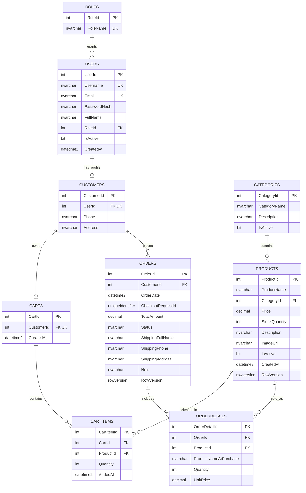

# S4 - Thiết kế cơ sở dữ liệu và phân tích 3NF

## 1. Cơ sở thiết kế và phạm vi

Tài liệu này dựa trên [S2 - Phân tích yêu cầu](S2-System-Analysis.md) và [S3 - Use Case](S3-Use-Cases.md). Cơ sở dữ liệu SQL Server **dự kiến**, tên `SportEquipmentStoreDb`, phục vụ cả website ASP.NET Core MVC và ứng dụng WinForms Admin. Đây là bản thiết kế để thẩm định trước khi triển khai; tại S4 chưa tạo database, bảng, script SQL, entity C# hoặc migration.

Thiết kế gồm **9 bảng**: `Roles`, `Users`, `Customers`, `Categories`, `Products`, `Carts`, `CartItems`, `Orders`, `OrderDetails`. Bảy bảng `Roles`, `Users`, `Categories`, `Products`, `Customers`, `Orders`, `OrderDetails` đáp ứng nhóm nghiệp vụ tối thiểu của đề bài; `Carts` và `CartItems` được bổ sung để hỗ trợ UC11–UC16: giỏ của Customer còn tồn tại khi đổi thiết bị/phiên và được Web đọc nhất quán. Giỏ chỉ chứa lựa chọn dự kiến: **không giữ hàng, không chốt giá**; UC15/UC16 phải kiểm tra lại sản phẩm, giá và tồn kho. Chưa lưu giỏ Guest vì S2/S3 chưa chốt chính sách này. Nếu sau này chọn giỏ tạm phía client, cần quyết định cách gộp giỏ trước khi sửa mô hình.

Những ranh giới thiết kế để tránh phát sinh bảng không cần thiết:

- `Roles` chỉ có `Admin` và `Customer` ở mức cốt lõi; `Users.RoleId` cho biết vai trò. Không lập `Permissions`/`UserRoles` khi chưa có yêu cầu quyền chi tiết hoặc nhiều vai trò cho một người.
- `Orders.Status` lưu trạng thái hiện tại. UC19 cần xem trạng thái mới nhất, chưa đòi hỏi lịch sử từng lần chuyển, nên chưa lập bảng trạng thái/audit riêng.
- Chưa có bảng thanh toán trực tuyến, vận đơn, khuyến mãi, đánh giá hoặc báo cáo lưu sẵn; đó là extension của S2.
- Chọn một `Customer` có đúng một `User`, và một `User` có tối đa một `Customer`. Tài khoản Admin không có dòng `Customers`; tài khoản Customer phải có dòng tương ứng khi đăng ký hoàn tất.

### 1.1. Quy ước dữ liệu và các quyết định thiết kế

| Chủ đề | Quy ước đề xuất |
|---|---|
| Khóa chính | `int IDENTITY(1,1)`, không tái sử dụng. Khóa ngoại `int` cùng kiểu. |
| Chuỗi tiếng Việt | `nvarchar(n)`; mô tả dài giới hạn bằng kích thước hợp lý. Không lưu mật khẩu rõ. |
| Ngày giờ | `datetime2(3)` theo UTC; `OrderDate`/`CreatedAt` mặc định thời gian UTC của SQL Server (`SYSUTCDATETIME()`). Hiển thị đổi múi giờ ở ứng dụng. |
| Tiền | `decimal(18,2)` cho `Products.Price`, `OrderDetails.UnitPrice` và `Orders.TotalAmount`; `CHECK >= 0`, không dùng `float`/`double`. |
| Giá trị luận lý | `bit NOT NULL`, `IsActive` mặc định `1`. |
| Trạng thái đơn | `nvarchar(20) NOT NULL`, mặc định `Pending`; dùng collation phân biệt hoa/thường cho cột và chỉ nhận đúng `Pending`, `Confirmed`, `Shipping`, `Completed`, `Cancelled`. Quyền chuyển trạng thái còn phải kiểm tra ở xử lý nghiệp vụ. |
| Giá trị chưa có | `Nullable = Có` chỉ khi nghiệp vụ thực sự cho phép thiếu; `Default = —` nghĩa là không khai báo mặc định. |
| Xóa liên quan | Mọi FK trong thiết kế dùng `ON DELETE NO ACTION`; trạng thái inactive hoặc thao tác dọn dữ liệu tường minh thay cho cascade ngầm. |

`Username` và `Email` là hai định danh **đều duy nhất** theo BR08. Đề xuất so sánh không phân biệt hoa/thường, phân biệt dấu bằng collation SQL Server `Latin1_General_100_CI_AS` tại hai cột và tạo unique constraint trực tiếp trên từng cột. Ứng dụng cắt khoảng trắng hai đầu trước khi lưu; một `CHECK` về giá trị đã trim sẽ bảo vệ các lần ghi không đi qua ứng dụng. Quyết định người dùng **đăng nhập bằng username, email hay cả hai** vẫn phải chốt; tính duy nhất của cả hai không phụ thuộc quyết định đó. Quy tắc chuẩn hóa email phức tạp hơn như alias/dấu chấm của từng nhà cung cấp không nằm trong phạm vi thiết kế.

`FullName` chỉ nằm ở `Users` cho thông tin hồ sơ hiện hành; `Customers` chứa liên hệ/giao hàng mặc định là `Phone`, `Address`. `Orders.ShippingFullName`, `ShippingPhone`, `ShippingAddress` là bản chụp tại thời điểm đặt hàng, độc lập với hồ sơ sau này. `OrderDetails.ProductNameAtPurchase` là bản chụp tên để đơn cũ vẫn dễ đọc khi tên sản phẩm thay đổi; `ProductId` vẫn tham chiếu sản phẩm gốc để quản lý. Không sao chép `Users.Email` hoặc `Users.FullName` vào `Customers`.

## 2. Quan hệ và toàn vẹn tham chiếu

| Quan hệ | Cardinality | FK và quy tắc | Lý do |
|---|---|---|---|
| `Roles` → `Users` | 1 → 0..N | `Users.RoleId` NOT NULL → `Roles.RoleId`; NO ACTION | Mỗi tài khoản có một vai trò hiện hành. Không xóa role còn được dùng. |
| `Users` → `Customers` | 1 → 0..1 | `Customers.UserId` NOT NULL, UNIQUE → `Users.UserId`; NO ACTION | Ràng buộc 1–1 ở phía có dòng Customer; Admin không có Customer. Việc Role = Customer và tạo đủ dòng Customer cần kiểm tra trong cùng giao dịch vì FK/CHECK đơn giản không xác minh được giá trị role ở bảng khác. |
| `Categories` → `Products` | 1 → 0..N | `Products.CategoryId` NOT NULL → `Categories.CategoryId`; NO ACTION | Không xóa danh mục đang có sản phẩm; khi ẩn phải xử lý sản phẩm active liên quan. |
| `Customers` → `Carts` | 1 → 0..1 | `Carts.CustomerId` NOT NULL, UNIQUE → `Customers.CustomerId`; NO ACTION | Tối đa một giỏ đang dùng trên mỗi Customer; giỏ tạo khi cần. |
| `Carts` → `CartItems` | 1 → 0..N | `CartItems.CartId` NOT NULL → `Carts.CartId`; NO ACTION | Giỏ rỗng hợp lệ; xóa CartItem là thao tác tường minh. |
| `Products` → `CartItems` | 1 → 0..N | `CartItems.ProductId` NOT NULL → `Products.ProductId`; NO ACTION | Không xóa cứng sản phẩm khi còn trong giỏ; inactive vẫn có thể hiển thị để Customer xóa. |
| `Customers` → `Orders` | 1 → 0..N | `Orders.CustomerId` NOT NULL → `Customers.CustomerId`; NO ACTION | Lịch sử đơn của khách được bảo toàn khi tài khoản inactive. |
| `Orders` → `OrderDetails` | 1 → 1..N về nghiệp vụ | `OrderDetails.OrderId` NOT NULL → `Orders.OrderId`; NO ACTION | FK cho phép 0 dòng ở mức một bản ghi đơn lẻ; điều kiện ít nhất một dòng phải bảo đảm trong giao dịch tạo đơn. |
| `Products` → `OrderDetails` | 1 → 0..N | `OrderDetails.ProductId` NOT NULL → `Products.ProductId`; NO ACTION | Giữ sản phẩm tham chiếu được và giá/tên snapshot của mọi đơn cũ. |

`UNIQUE(Customers.UserId)` cùng FK không null là cách buộc **tối đa một** dòng Customer cho một User. Quy tắc **Customer-role User phải có một dòng Customer** không thể suy ra từ một FK đơn hướng; quy trình tạo tài khoản cần tạo cả hai trong cùng giao dịch, không cho đổi Role gây trạng thái mồ côi. `UNIQUE(Carts.CustomerId)` buộc tối đa một Cart cho Customer; không bắt buộc tạo Cart khi chỉ vừa đăng ký.

## 3. Thiết kế bảng

Mỗi bảng dưới đây dùng đúng các cột: `Column`, `SQL Type`, `Nullable`, `PK`, `FK`, `Unique`, `Default`, `Description`. `Có` ở cột `Unique` cho khóa đơn; các khóa unique ghép được nêu tại mục 3.10. `PK` mặc nhiên NOT NULL và Unique. Không có SQL DDL trong tài liệu này.

### 3.1. Roles

| Column | SQL Type | Nullable | PK | FK | Unique | Default | Description |
|---|---|---|---|---|---|---|---|
| RoleId | int | Không | Có | — | PK | IDENTITY(1,1) | Định danh vai trò. |
| RoleName | nvarchar(30) | Không | — | — | Có | — | Tên vai trò duy nhất, dự kiến `Admin` hoặc `Customer`. |

### 3.2. Users

| Column | SQL Type | Nullable | PK | FK | Unique | Default | Description |
|---|---|---|---|---|---|---|---|
| UserId | int | Không | Có | — | PK | IDENTITY(1,1) | Định danh tài khoản đăng nhập. |
| Username | nvarchar(50) | Không | — | — | Có | — | Tên đăng nhập duy nhất, không phân biệt hoa/thường theo collation đề xuất. |
| Email | nvarchar(254) | Không | — | — | Có | — | Email duy nhất; có thể dùng làm định danh khi chính sách được chốt. |
| PasswordHash | nvarchar(512) | Không | — | — | — | — | Kết quả từ thư viện băm mật khẩu có salt; không phải mật khẩu rõ. |
| FullName | nvarchar(150) | Không | — | — | — | — | Họ tên hồ sơ hiện hành của Customer/Admin. |
| RoleId | int | Không | — | Roles.RoleId | — | — | Vai trò hiện hành của tài khoản. |
| IsActive | bit | Không | — | — | — | 1 | Tài khoản inactive không được đăng nhập. |
| CreatedAt | datetime2(3) | Không | — | — | — | SYSUTCDATETIME() | Thời điểm tạo tài khoản, UTC. |

### 3.3. Customers

| Column | SQL Type | Nullable | PK | FK | Unique | Default | Description |
|---|---|---|---|---|---|---|---|
| CustomerId | int | Không | Có | — | PK | IDENTITY(1,1) | Định danh khách hàng trong giỏ và đơn. |
| UserId | int | Không | — | Users.UserId | Có | — | Liên kết 1–1 với User có Role `Customer`. |
| Phone | nvarchar(20) | Có | — | — | — | — | Số điện thoại hồ sơ; checkout vẫn phải xác nhận số người nhận. |
| Address | nvarchar(500) | Có | — | — | — | — | Địa chỉ mặc định trong hồ sơ; có thể bỏ trống cho đến checkout. |

### 3.4. Categories

| Column | SQL Type | Nullable | PK | FK | Unique | Default | Description |
|---|---|---|---|---|---|---|---|
| CategoryId | int | Không | Có | — | PK | IDENTITY(1,1) | Định danh danh mục. |
| CategoryName | nvarchar(120) | Không | — | — | — | — | Tên danh mục; chính sách trùng tên còn mở từ S2. |
| Description | nvarchar(1000) | Có | — | — | — | — | Mô tả tùy chọn. |
| IsActive | bit | Không | — | — | — | 1 | Danh mục hiển thị với Guest/Customer khi active. |

### 3.5. Products

| Column | SQL Type | Nullable | PK | FK | Unique | Default | Description |
|---|---|---|---|---|---|---|---|
| ProductId | int | Không | Có | — | PK | IDENTITY(1,1) | Định danh sản phẩm. |
| ProductName | nvarchar(200) | Không | — | — | — | — | Tên sản phẩm hiện hành, có thể thay đổi trong quản trị. |
| CategoryId | int | Không | — | Categories.CategoryId | — | — | Danh mục hiện hành của sản phẩm. |
| Price | decimal(18,2) | Không | — | — | — | — | Giá bán hiện hành, phải >= 0. |
| StockQuantity | int | Không | — | — | — | 0 | Tồn kho hiện hành, phải >= 0. |
| Description | nvarchar(2000) | Có | — | — | — | — | Mô tả chi tiết tùy chọn. |
| ImageUrl | nvarchar(2048) | Có | — | — | — | — | Đường dẫn/tham chiếu ảnh; nơi lưu ảnh vật lý còn phải chốt. |
| IsActive | bit | Không | — | — | — | 1 | Inactive: không được mua mới; lịch sử đơn vẫn còn. |
| CreatedAt | datetime2(3) | Không | — | — | — | SYSUTCDATETIME() | Thời điểm tạo sản phẩm, UTC. |
| RowVersion | rowversion | Không | — | — | — | SQL Server tự sinh | Dấu phiên bản để phát hiện Admin/Web cập nhật đồng thời; không phải thời gian. |

### 3.6. Carts

| Column | SQL Type | Nullable | PK | FK | Unique | Default | Description |
|---|---|---|---|---|---|---|---|
| CartId | int | Không | Có | — | PK | IDENTITY(1,1) | Định danh giỏ. |
| CustomerId | int | Không | — | Customers.CustomerId | Có | — | Chủ sở hữu giỏ; tối đa một giỏ cho mỗi Customer. |
| CreatedAt | datetime2(3) | Không | — | — | — | SYSUTCDATETIME() | Thời điểm tạo giỏ, UTC. |

### 3.7. CartItems

| Column | SQL Type | Nullable | PK | FK | Unique | Default | Description |
|---|---|---|---|---|---|---|---|
| CartItemId | int | Không | Có | — | PK | IDENTITY(1,1) | Định danh dòng giỏ. |
| CartId | int | Không | — | Carts.CartId | Ghép | — | Giỏ chứa dòng hàng. |
| ProductId | int | Không | — | Products.ProductId | Ghép | — | Sản phẩm được chọn; duy nhất cùng CartId. |
| Quantity | int | Không | — | — | — | — | Số lượng dự kiến, nguyên dương; kiểm tra lại tồn kho khi mua. |
| AddedAt | datetime2(3) | Không | — | — | — | SYSUTCDATETIME() | Thời điểm thêm dòng vào giỏ, UTC. |

### 3.8. Orders

| Column | SQL Type | Nullable | PK | FK | Unique | Default | Description |
|---|---|---|---|---|---|---|---|
| OrderId | int | Không | Có | — | PK | IDENTITY(1,1) | Mã/định danh đơn hàng. |
| CustomerId | int | Không | — | Customers.CustomerId | Ghép | — | Khách sở hữu đơn; cùng CheckoutRequestId định danh lần xác nhận. |
| OrderDate | datetime2(3) | Không | — | — | — | SYSUTCDATETIME() | Thời điểm ghi nhận đơn, UTC. |
| CheckoutRequestId | uniqueidentifier | Không | — | — | Ghép | — | Mã của một lần xác nhận checkout để chống tạo đơn lặp khi gửi lại; duy nhất cùng CustomerId. |
| TotalAmount | decimal(18,2) | Không | — | — | — | — | Tổng tiền lưu cùng đơn, bằng tổng Quantity × UnitPrice của OrderDetails. |
| Status | nvarchar(20) | Không | — | — | — | Pending | Trạng thái hiện hành; miền giá trị và chuyển trạng thái có kiểm soát. |
| ShippingFullName | nvarchar(150) | Không | — | — | — | — | Tên người nhận chụp khi đặt hàng. |
| ShippingPhone | nvarchar(20) | Không | — | — | — | — | Số điện thoại nhận hàng chụp khi đặt hàng. |
| ShippingAddress | nvarchar(500) | Không | — | — | — | — | Địa chỉ giao hàng chụp khi đặt hàng. |
| Note | nvarchar(1000) | Có | — | — | — | — | Ghi chú giao hàng tùy chọn. |
| RowVersion | rowversion | Không | — | — | — | SQL Server tự sinh | Dấu phiên bản để phát hiện cập nhật trạng thái đơn đồng thời; không phải thời gian. |

### 3.9. OrderDetails

| Column | SQL Type | Nullable | PK | FK | Unique | Default | Description |
|---|---|---|---|---|---|---|---|
| OrderDetailId | int | Không | Có | — | PK | IDENTITY(1,1) | Định danh dòng đơn. |
| OrderId | int | Không | — | Orders.OrderId | Ghép | — | Đơn chứa dòng hàng. |
| ProductId | int | Không | — | Products.ProductId | Ghép | — | Sản phẩm gốc; kết hợp OrderId phải duy nhất. |
| ProductNameAtPurchase | nvarchar(200) | Không | — | — | — | — | Tên sản phẩm chụp lúc mua, giữ lịch sử khi tên hiện hành đổi. |
| Quantity | int | Không | — | — | — | — | Số lượng đã mua, nguyên dương. |
| UnitPrice | decimal(18,2) | Không | — | — | — | — | Giá đã chốt cho một đơn vị tại thời điểm mua. |

### 3.10. Ràng buộc bổ sung ngoài từng cột

| Ràng buộc đề xuất | Tác dụng |
|---|---|
| `UNIQUE(Roles.RoleName)` | Không tạo hai role cùng tên. |
| `UNIQUE(Users.Username)` và `UNIQUE(Users.Email)` | BR08, áp dụng collation/cắt khoảng trắng thống nhất như mục 1.1. Không cho giá trị NULL. |
| `UNIQUE(Customers.UserId)` | Bảo đảm mỗi User có tối đa một hồ sơ Customer. |
| `UNIQUE(Carts.CustomerId)` | Bảo đảm một giỏ đang dùng cho mỗi Customer. |
| `UNIQUE(CartItems.CartId, CartItems.ProductId)` | Một sản phẩm xuất hiện một lần trong cùng giỏ; UC11 cộng/cập nhật Quantity thay vì tạo dòng trùng. |
| `UNIQUE(OrderDetails.OrderId, OrderDetails.ProductId)` | Một sản phẩm xuất hiện một lần trong một đơn; giữ một snapshot UnitPrice cho mỗi mặt hàng. |
| `UNIQUE(Orders.CustomerId, Orders.CheckoutRequestId)` | Một lần xác nhận checkout của Customer chỉ tạo tối đa một đơn, kể cả khi gửi lại sau khi mất phản hồi. Mã yêu cầu phải được tạo trước khi gửi và dùng lại khi retry cùng lần mua. |
| `CHECK(Products.Price >= 0)`; `CHECK(Products.StockQuantity >= 0)` | BR01–BR02; không chặn giá 0 ở tầng dữ liệu vì S2 còn yêu cầu chốt giá 0 có được kinh doanh hay không. |
| `CHECK(CartItems.Quantity > 0)`; `CHECK(OrderDetails.Quantity > 0)` | BR03; ngoài ra số lượng phải là số nguyên theo kiểu `int`. |
| `CHECK(OrderDetails.UnitPrice >= 0)`; `CHECK(Orders.TotalAmount >= 0)` | Giá lịch sử/tổng tiền không âm. |
| `CHECK(Orders.Status IN ('Pending','Confirmed','Shipping','Completed','Cancelled'))` | Giới hạn miền giá trị, **không** thay thế kiểm tra quyền/chuyển trạng thái BR13. |
| Kiểm tra không rỗng cho tên, định danh, hash, thông tin giao hàng | `NOT NULL` chưa ngăn chuỗi `''` hoặc toàn khoảng trắng; cần kiểm tra tại lớp nhập/xử lý và dùng CHECK phù hợp khi triển khai. |

`UNIQUE` trên `CartItems`/`OrderDetails` là unique **ghép**, không yêu cầu `CartId`, `OrderId` hay `ProductId` duy nhất riêng lẻ. Các unique constraint tự có chỉ mục hỗ trợ tra cứu theo khóa đầu. `Orders.TotalAmount` và điều kiện đơn có ít nhất một `OrderDetail` là quy tắc liên bảng: không thể bảo đảm bằng CHECK trên một dòng Orders; quy trình tạo đơn phải kiểm tra và ghi các phần cùng giao dịch. Điều kiện sản phẩm active khi mua, Category active khi hiển thị, vai trò Customer khi tạo `Customers` và chuyển trạng thái hợp lệ cũng cần kiểm tra nghiệp vụ, không được giả định FK/CHECK đã giải quyết.

Với `Orders.Status`, một CHECK so chuỗi trong database dùng collation không phân biệt hoa/thường có thể chấp nhận cả biến thể như `pending`. Vì vậy đề xuất collation phân biệt hoa/thường cho riêng cột Status (chẳng hạn `Latin1_General_100_BIN2`) và ghi giá trị từ tập hằng trạng thái cố định; miền giá trị và chuyển trạng thái là hai ràng buộc khác nhau.

`Products.RowVersion` và `Orders.RowVersion` là dấu thay đổi do SQL Server sinh, dùng để phát hiện việc sửa sản phẩm/tồn kho hoặc trạng thái đơn dựa trên dữ liệu cũ. Chúng không phải ngày giờ và không thay thế giao dịch khi kiểm tra tồn kho, tạo đơn, hoặc cập nhật giỏ. `CheckoutRequestId` tránh một lần xác nhận tạo hai đơn; ràng buộc unique là lớp bảo vệ cuối, còn hệ thống phải trả đúng đơn cũ khi khách gửi lại cùng mã.

## 4. Tiền, giỏ hàng và lịch sử đơn

`decimal(18,2)` lưu giá trị thập phân chính xác đến hai chữ số sau dấu phẩy; `float`/`double` là số dấu phẩy động nhị phân có sai số biểu diễn, nên không dùng cho tiền, so sánh giá hoặc tính tổng giao dịch. Khi tính `Quantity × UnitPrice` và cộng nhiều dòng, phép tính trung gian cần độ chính xác/range đủ lớn rồi kiểm tra kết quả nằm trong miền của `decimal(18,2)` trước khi lưu; không lặng lẽ cắt hoặc tràn giá trị. Quy tắc làm tròn nếu sau này phát sinh thuế, phí hoặc giảm giá sẽ phải được phân tích riêng.

`Products.Price` là giá **hiện hành**. `CartItems` không lưu giá vì giỏ không chốt mua; W06/W07 đọc giá hiện hành và báo khi đổi. UC16 kiểm tra lại giá trước lúc ghi. Mỗi `OrderDetails.UnitPrice` và `ProductNameAtPurchase` chụp giá/tên sản phẩm tại thời điểm mua. W10/A10 đọc snapshot của `OrderDetails`, không dùng `Products.Price`/`ProductName` hiện tại để tái tạo lịch sử. Sản phẩm inactive vẫn tồn tại để FK hợp lệ. `Orders.ShippingFullName`, `ShippingPhone`, `ShippingAddress` chụp thông tin giao hàng được Customer xác nhận, không trỏ về các giá trị hồ sơ có thể sửa.

`Orders.TotalAmount` là tổng **đã chốt** của các `OrderDetails` thuộc cùng đơn: `SUM(Quantity × UnitPrice)`, không lấy tổng do client gửi, không tự cộng phí/thuế/khuyến mãi chưa có trong S2/S3. Dòng đơn, giá snapshot và tổng phải được ghi trong cùng giao dịch; sau khi tạo đơn, không sửa tùy ý các dòng/giá mà không có quy trình điều chỉnh đã được phân tích. Mục 6 nêu rõ đây là một giá trị tổng hợp được lưu dư thừa có chủ đích, cùng rủi ro nhất quán của nó.

Đề xuất nghiệp vụ để thiết kế dữ liệu đủ vận hành: khi UC16 tạo đơn thành công thì giảm `Products.StockQuantity` trong cùng giao dịch sau khi kiểm tra lượng còn; khi đơn Pending hoặc Confirmed được hủy hợp lệ thì hoàn phần tồn đã giảm **một lần** trong cùng giao dịch đổi trạng thái. Nếu chính sách cuối cùng chọn giữ hàng/trừ khi xác nhận, quy trình tồn kho phải được thiết kế lại trước triển khai. `CHECK(StockQuantity >= 0)` bảo vệ giá trị mỗi dòng, nhưng không tự ngăn hai checkout cùng mua phần tồn cuối; thao tác cập nhật phải có điều kiện đủ tồn và xử lý xung đột đồng thời. Chuyển trạng thái `Pending → Confirmed → Shipping → Completed` và nhánh `Cancelled` tuân S2/S3; khi đã Shipping, Completed hoặc Cancelled không tự động hủy/hoàn tồn. `Orders.Status` hiện không lưu lịch sử chuyển trạng thái; nếu cần audit đầy đủ, thiết kế bảng lịch sử là bước mở rộng sau.

Giỏ có một `Carts` cho mỗi Customer và nhiều `CartItems`. `UNIQUE(CartId,ProductId)` ngăn hai dòng trùng sản phẩm. UC11/UC13 kiểm tra số lượng và tồn để phản hồi sớm; UC16 luôn kiểm tra lại vì giỏ không dự trữ hàng. Sau khi ghi đơn thành công, chỉ xử lý các dòng giỏ thuộc lần đặt hàng đã xác nhận; thay đổi từ phiên khác phải được phát hiện để không xóa nhầm hàng vừa thêm. Các chi tiết khóa/giao dịch/giải quyết xung đột sẽ được chốt khi triển khai, không tạo bảng giỏ phụ ở S4.

## 5. Chiến lược xóa và bảo toàn dữ liệu

| Dữ liệu | Chiến lược đề xuất | Ràng buộc bảo vệ lịch sử |
|---|---|---|
| Product đã có `OrderDetails` | Đặt `Products.IsActive = 0`; có thể giữ hiển thị chỉ trong đơn cũ. | FK NO ACTION chặn xóa cứng khi còn dòng đơn. Không đổi `OrderDetails.UnitPrice`/tên snapshot. |
| Product còn trong `CartItems` | Đặt inactive và báo ở giỏ; Customer tự xóa/thay mặt hàng. | FK NO ACTION chặn xóa cứng âm thầm; UC15/UC16 từ chối mua hàng inactive. |
| Category còn có Product | Đặt `Categories.IsActive = 0` chỉ sau khi xử lý các Product active liên quan theo chính sách. | FK NO ACTION chặn xóa cứng; không tự cascade xóa/ẩn sản phẩm hàng loạt. |
| Customer đã có Order | Đặt `Users.IsActive = 0` nếu cần khóa tài khoản; giữ `Customers` và `Orders`. | FK NO ACTION bảo toàn liên kết Customer → Orders; W09/A08 vẫn xem được lịch sử theo quyền. |
| User/Admin/Role | Dùng `Users.IsActive`; Role đang được dùng giữ nguyên. | FK NO ACTION từ Users/Customers; không cho đổi Role làm Customer/User lệch nhau hoặc khóa Admin cuối cùng nếu chính sách yêu cầu. |
| Orders và OrderDetails | Không xóa cứng trong luồng thông thường; hủy bằng `Status = Cancelled` theo điều kiện. | FK NO ACTION giữ dòng chi tiết/sản phẩm; việc hủy không phải lệnh xóa dữ liệu. |
| Cart/CartItems | UC14 xóa CartItem được chọn; sau đơn thành công dọn đúng các dòng đã đặt. | Thao tác tường minh, có kiểm tra quyền chủ giỏ và xung đột; không dùng cascade xóa từ Customer/Product. |

Khóa ngoại ngăn mất tham chiếu, nhưng không ngăn xóa cứng một Product **chưa có** dòng tham chiếu. Ứng dụng quản trị vẫn ưu tiên inactive để lịch sử danh mục/sản phẩm nhất quán và chỉ cho xóa cứng dữ liệu nháp khi có chính sách cụ thể. Không có cột `IsDeleted` riêng: `IsActive` đã đáp ứng yêu cầu ẩn/ngừng bán/khóa tài khoản ở phạm vi S2/S3; `Orders` dùng trạng thái thay vì soft delete.

## 6. Phân tích chuẩn hóa 1NF, 2NF, 3NF

### 6.1. 1NF - Giá trị nguyên tử, không nhóm lặp

Mỗi cột có một giá trị theo nghĩa nghiệp vụ: `Users.Email`, `Products.Price`, `Orders.Status`, v.v. Một giỏ không có `Product1`, `Product2`... trong cùng dòng; mỗi mặt hàng là một `CartItems`. Một đơn không lưu danh sách sản phẩm trong một chuỗi; mỗi mặt hàng là một `OrderDetails`. `Orders.ShippingAddress` là một trường địa chỉ nhập/hiển thị nguyên khối theo phạm vi giao hàng hiện tại; nếu sau này cần lọc theo tỉnh/quận hoặc tính phí theo vùng, phải tách địa chỉ theo yêu cầu mới. Ảnh sản phẩm hiện là một tham chiếu tùy chọn; nhiều ảnh nếu trở thành yêu cầu sẽ cần bảng riêng, không nhét danh sách URL vào một cột.

### 6.2. 2NF - Phụ thuộc đầy đủ vào khóa

Các bảng dùng một khóa chính đơn (`UserId`, `ProductId`, `OrderId`, `OrderDetailId`...). Hai ràng buộc unique ghép `CartItems(CartId,ProductId)` và `OrderDetails(OrderId,ProductId)` cũng là khóa ứng viên. `CartItems.Quantity` mô tả **sản phẩm cụ thể trong giỏ cụ thể**, không chỉ Cart hay chỉ Product; `OrderDetails.Quantity`, `UnitPrice` và `ProductNameAtPurchase` mô tả **mặt hàng cụ thể trong đơn cụ thể**, không chỉ Order hay Product. Vì vậy không đặt `ProductName` hiện hành, `CategoryName` hoặc thông tin Customer lên mỗi dòng giỏ/đơn. Thông tin đó được tham chiếu hoặc chụp tại thời điểm mua khi cần bảo toàn lịch sử.

### 6.3. 3NF - Không phụ thuộc bắc cầu giữa các thuộc tính hiện hành

- `Users.RoleId` tham chiếu `Roles.RoleName`; không sao chép RoleName vào Users. `Customers.UserId` duy nhất trỏ tới Users; không lặp `Email`/`FullName` trong Customers. Nhờ vậy sửa email/họ tên chỉ sửa tại Users và profile hiện hành nhất quán.
- `Products.CategoryId` tham chiếu Categories; không lặp `CategoryName` trong Products. Đổi tên danh mục không buộc cập nhật mọi sản phẩm. `ProductName`/`Price` hiện hành nằm ở Products, không nằm trong `CartItems`.
- `Orders.CustomerId` tham chiếu Customers; không lặp thông tin hồ sơ hiện hành. Các trường `Shipping*` **không phải bản sao để đồng bộ**: chúng là sự kiện giao hàng của chính đơn đó, cố ý không đổi khi người dùng sửa hồ sơ.
- `OrderDetails.UnitPrice` và `ProductNameAtPurchase` là dữ liệu **lịch sử tại thời điểm mua**, không thể thay bằng `Products.Price`/`ProductName` hiện hành. Với mỗi dòng đơn, chúng phụ thuộc vào lần mua cụ thể; đây không phải các cột hiện hành bị lặp do quên tách bảng.
- `Carts.CustomerId` là khóa ứng viên qua UNIQUE, còn `CreatedAt` phụ thuộc vào giỏ/khách tương ứng. Không có nhóm thuộc tính phụ thuộc vào một thuộc tính không khóa của Carts.

**Ngoại lệ cần công bố:** `Orders.TotalAmount` có thể suy ra từ các dòng `OrderDetails`. Xét phụ thuộc hàm **trong từng bảng**, các thuộc tính Orders vẫn phụ thuộc vào `OrderId` và không có phụ thuộc bắc cầu không khóa → không khóa; tuy nhiên toàn bộ mô hình có một giá trị tổng hợp dư thừa **liên bảng**, có nguy cơ sai khi chi tiết đổi mà tổng không đổi. Đây là phi chuẩn hóa có kiểm soát để hiển thị nhanh và lưu số tiền đã chốt. Chỉ tạo/sửa Order và các dòng cùng giao dịch, đối chiếu lại tổng khi đọc/kiểm tra. Nếu cần loại bỏ hoàn toàn dư thừa tổng hợp để giữ mô hình nghiêm ngặt hơn, bỏ cột `Orders.TotalAmount` và tính tổng từ `OrderDetails` khi đọc; khi đó mọi màn hình phải chấp nhận chi phí tính tổng. Bản S4 chọn cột lưu tổng theo yêu cầu lịch sử/tra cứu của S2/S3 và nêu rõ đánh đổi, **không khẳng định không có dư thừa**.

`Products.RowVersion`/`Orders.RowVersion` là metadata phục vụ kiểm soát đồng thời, không phải dữ liệu nghiệp vụ sao chép từ bảng khác. `CheckoutRequestId` là định danh lần xác nhận, không thay `OrderId` hoặc chi tiết đơn. 1NF, 2NF và phụ thuộc hàm 3NF được phân tích cho từng quan hệ; quy tắc tổng tiền/ít nhất một dòng, tính active và chuyển trạng thái phải được kiểm soát ngoài các FK/CHECK đơn giản.

## 7. Chiến lược chỉ mục

PK và UNIQUE ở mục 3 tự tạo chỉ mục. Không tạo thêm index riêng cho cùng khóa nếu không có bằng chứng nhu cầu. Bảng dưới là **đề xuất ban đầu**, cần đo truy vấn thực tế trước khi mở rộng; mọi index tăng chi phí ghi, đặc biệt trên Product/Order.

| Index/khóa | Cột theo thứ tự | Phục vụ | Ghi chú |
|---|---|---|---|
| UNIQUE `Users.Username` | Username | Đăng nhập/tra cứu username, BR08. | Sử dụng collation không phân biệt hoa/thường; không thêm index Username trùng lặp. |
| UNIQUE `Users.Email` | Email | Đăng ký, tra cứu email, BR08. | Không thêm index Email trùng lặp. |
| UNIQUE `Customers.UserId` | UserId | Tra cứu hồ sơ Customer từ tài khoản. | Đồng thời ràng buộc 1–1. |
| UNIQUE `Carts.CustomerId` | CustomerId | Mở giỏ theo khách. | Đồng thời ràng buộc một giỏ/Customer. |
| UNIQUE `CartItems(CartId,ProductId)` | CartId, ProductId | Xem giỏ và upsert dòng mặt hàng. | Không cần index CartId riêng. |
| UNIQUE `OrderDetails(OrderId,ProductId)` | OrderId, ProductId | Xem chi tiết đơn, chống dòng trùng. | Không cần index OrderId riêng; ProductId tra cứu ngược chỉ thêm nếu có truy vấn thực tế. |
| UNIQUE `Orders(CustomerId,CheckoutRequestId)` | CustomerId, CheckoutRequestId | Chống đặt hàng lặp cho cùng lần xác nhận. | Không thay index lịch sử theo thời gian. |
| `IX_Products_CategoryId_IsActive` | CategoryId, IsActive | UC03/UC05 và quản trị lọc danh mục/trạng thái. | Chọn danh mục là điều kiện chính; xét thêm cột Price sau khi có truy vấn thực tế. |
| `IX_Products_ProductName` | ProductName | Tìm theo tiền tố/sắp xếp tên trên danh sách. | B-tree thường không tăng tốc `LIKE '%từ_khóa%'`; chỉ xem xét full-text khi nhu cầu tìm chứa từ lớn. |
| `IX_Orders_CustomerId_OrderDate` | CustomerId, OrderDate DESC | UC17: lịch sử đơn của một khách theo mới nhất. | Không thêm index CustomerId riêng. |
| `IX_Orders_Status_OrderDate` | Status, OrderDate DESC | UC36: lọc trạng thái và ngày cho Admin. | Hỗ trợ tốt khi điều kiện có Status; không thay thế index bắt đầu bằng OrderDate. |
| `IX_Orders_OrderDate` | OrderDate DESC | UC35/UC36: danh sách gần đây và lọc theo khoảng ngày trên toàn bộ đơn. | Truy vấn chỉ theo ngày không dùng hiệu quả hai index trên vì CustomerId/Status đứng đầu; giữ index này để hỗ trợ yêu cầu lọc thời gian. |

`Orders.OrderDate` là cột thứ hai trong hai index theo Customer/Status, nên thêm một index bắt đầu bằng OrderDate cho bộ lọc ngày không kèm Customer/Status ở UC36. Ba index phụ trên Orders phục vụ ba kiểu truy vấn khác nhau; khi có dữ liệu thực, kiểm tra kế hoạch truy vấn để bỏ index ít dùng, tránh chi phí ghi không cần thiết. `Products.CategoryId`, `Orders.Status`, `Orders.CustomerId`, `ProductName`, `Username` và `Email` đều có hướng tra cứu cụ thể. Không lập index riêng cho mọi FK hoặc cột văn bản theo thói quen; với dữ liệu ít, ưu tiên PK/UNIQUE và các truy vấn quan trọng trước.

## 8. ERD dự kiến

Sơ đồ biểu diễn khóa chính (PK), khóa ngoại (FK) và cardinality. `UK` trên sơ đồ chỉ đánh dấu khóa unique **một cột**; các unique ghép phải đọc ở mục 3.10. `nvarchar` và `decimal` trong Mermaid là tên kiểu rút gọn; chiều dài/precision đúng theo bảng ở mục 3. `OrderDetails` 1..N là **quy tắc nghiệp vụ** khi đơn đã được tạo hoàn tất, chưa thể suy ra chỉ từ FK.

## 9. Data Dictionary

Từ điển dưới đây liệt kê **mọi cột** của chín bảng ở mục 3 để có thể đưa vào báo cáo. `NN` = NOT NULL; `NULL` = cho phép thiếu; `PK` = khóa chính; `FK` = khóa ngoại; `UQ` = unique một cột; `UQ ghép` = thành phần của unique nhiều cột. Ràng buộc CHECK và default chi tiết ở mục 3.10; kiểu và độ dài tại đây là kiểu SQL Server dự kiến.

| Table | Column | Meaning | Data type | Constraints |
|---|---|---|---|---|
| Roles | RoleId | Mã vai trò. | int | PK, NN, IDENTITY. |
| Roles | RoleName | Tên vai trò. | nvarchar(30) | NN, UQ. |
| Users | UserId | Mã tài khoản. | int | PK, NN, IDENTITY. |
| Users | Username | Tên đăng nhập. | nvarchar(50) | NN, UQ, trim/collation thống nhất. |
| Users | Email | Email định danh/liên hệ. | nvarchar(254) | NN, UQ, trim/collation thống nhất. |
| Users | PasswordHash | Chuỗi hash mật khẩu. | nvarchar(512) | NN, không lưu plaintext. |
| Users | FullName | Họ tên hiện hành. | nvarchar(150) | NN, không rỗng. |
| Users | RoleId | Vai trò hiện hành. | int | NN, FK → Roles.RoleId. |
| Users | IsActive | Được phép đăng nhập hay không. | bit | NN, default 1. |
| Users | CreatedAt | Thời điểm tạo UTC. | datetime2(3) | NN, default SYSUTCDATETIME(). |
| Customers | CustomerId | Mã khách hàng. | int | PK, NN, IDENTITY. |
| Customers | UserId | Tài khoản tương ứng. | int | NN, FK → Users.UserId, UQ. |
| Customers | Phone | Số điện thoại hồ sơ. | nvarchar(20) | NULL. |
| Customers | Address | Địa chỉ mặc định. | nvarchar(500) | NULL. |
| Categories | CategoryId | Mã danh mục. | int | PK, NN, IDENTITY. |
| Categories | CategoryName | Tên danh mục hiện hành. | nvarchar(120) | NN, không rỗng; trùng tên chưa chốt. |
| Categories | Description | Mô tả danh mục. | nvarchar(1000) | NULL. |
| Categories | IsActive | Trạng thái hiển thị danh mục. | bit | NN, default 1. |
| Products | ProductId | Mã sản phẩm. | int | PK, NN, IDENTITY. |
| Products | ProductName | Tên hiện hành của sản phẩm. | nvarchar(200) | NN, không rỗng. |
| Products | CategoryId | Danh mục của sản phẩm. | int | NN, FK → Categories.CategoryId. |
| Products | Price | Giá bán hiện hành. | decimal(18,2) | NN, CHECK >= 0. |
| Products | StockQuantity | Số tồn hiện hành. | int | NN, default 0, CHECK >= 0. |
| Products | Description | Mô tả sản phẩm. | nvarchar(2000) | NULL. |
| Products | ImageUrl | Tham chiếu ảnh. | nvarchar(2048) | NULL. |
| Products | IsActive | Trạng thái được bán. | bit | NN, default 1. |
| Products | CreatedAt | Thời điểm tạo UTC. | datetime2(3) | NN, default SYSUTCDATETIME(). |
| Products | RowVersion | Dấu cập nhật đồng thời. | rowversion | NN, SQL Server tự sinh. |
| Carts | CartId | Mã giỏ hàng. | int | PK, NN, IDENTITY. |
| Carts | CustomerId | Chủ sở hữu giỏ. | int | NN, FK → Customers.CustomerId, UQ. |
| Carts | CreatedAt | Thời điểm tạo giỏ UTC. | datetime2(3) | NN, default SYSUTCDATETIME(). |
| CartItems | CartItemId | Mã dòng giỏ. | int | PK, NN, IDENTITY. |
| CartItems | CartId | Giỏ chứa dòng. | int | NN, FK → Carts.CartId, UQ ghép với ProductId. |
| CartItems | ProductId | Sản phẩm dự định mua. | int | NN, FK → Products.ProductId, UQ ghép với CartId. |
| CartItems | Quantity | Số lượng dự kiến. | int | NN, CHECK > 0. |
| CartItems | AddedAt | Thời điểm thêm dòng UTC. | datetime2(3) | NN, default SYSUTCDATETIME(). |
| Orders | OrderId | Mã đơn. | int | PK, NN, IDENTITY. |
| Orders | CustomerId | Khách đặt đơn. | int | NN, FK → Customers.CustomerId, UQ ghép với CheckoutRequestId. |
| Orders | OrderDate | Thời điểm đặt UTC. | datetime2(3) | NN, default SYSUTCDATETIME(). |
| Orders | CheckoutRequestId | Mã lần xác nhận để chống tạo trùng. | uniqueidentifier | NN, UQ ghép với CustomerId. |
| Orders | TotalAmount | Tổng số tiền đã chốt. | decimal(18,2) | NN, CHECK >= 0; tổng từ OrderDetails. |
| Orders | Status | Trạng thái hiện hành. | nvarchar(20) | NN, default Pending, CHECK miền giá trị. |
| Orders | ShippingFullName | Tên người nhận lúc đặt. | nvarchar(150) | NN, không rỗng. |
| Orders | ShippingPhone | Điện thoại giao hàng lúc đặt. | nvarchar(20) | NN, không rỗng. |
| Orders | ShippingAddress | Địa chỉ giao hàng lúc đặt. | nvarchar(500) | NN, không rỗng. |
| Orders | Note | Ghi chú giao hàng. | nvarchar(1000) | NULL. |
| Orders | RowVersion | Dấu cập nhật trạng thái đồng thời. | rowversion | NN, SQL Server tự sinh. |
| OrderDetails | OrderDetailId | Mã dòng đơn. | int | PK, NN, IDENTITY. |
| OrderDetails | OrderId | Đơn chứa dòng. | int | NN, FK → Orders.OrderId, UQ ghép với ProductId. |
| OrderDetails | ProductId | Sản phẩm gốc. | int | NN, FK → Products.ProductId, UQ ghép với OrderId. |
| OrderDetails | ProductNameAtPurchase | Tên chụp lúc mua. | nvarchar(200) | NN, không rỗng; snapshot. |
| OrderDetails | Quantity | Số lượng đã mua. | int | NN, CHECK > 0. |
| OrderDetails | UnitPrice | Giá một đơn vị lúc mua. | decimal(18,2) | NN, CHECK >= 0; snapshot. |

## 10. Kế hoạch dữ liệu mẫu (chưa seed)

| Nhóm | Kế hoạch bản ghi | Mục đích kiểm tra về sau |
|---|---|---|
| Roles | `Admin`, `Customer`. | Đăng nhập/kiểm tra quyền, không cấp quyền Admin khi Customer đăng ký. |
| Categories | `Bóng đá`, `Cầu lông`, `Bóng rổ`, `Tennis`, `Gym & Fitness`, `Bơi lội`. | Duyệt/lọc theo sáu nhóm hàng. |
| Products thuộc Bóng đá | `Bóng đá size 5`, `Găng tay thủ môn`. | Danh sách sản phẩm và tồn kho. |
| Products thuộc Cầu lông | `Vợt cầu lông`, `Ống cầu lông`. | Chi tiết/giá và tìm kiếm tên. |
| Products thuộc Bóng rổ | `Bóng rổ size 7`. | Lọc theo danh mục. |
| Products thuộc Tennis | `Vợt tennis`, `Bộ bóng tennis`. | Nhiều sản phẩm cùng danh mục. |
| Products thuộc Gym & Fitness | `Dây kháng lực`, `Thảm tập yoga`. | Kiểm tra tìm kiếm và mặt hàng giá khác nhau. |
| Products thuộc Bơi lội | `Kính bơi`, `Mũ bơi`. | Kiểm tra hiển thị hàng còn/hết. |

Khi triển khai seed sau S4, chỉ dùng dữ liệu giả; đặt giá và tồn kho dương cho phần lớn sản phẩm, có thêm một sản phẩm hết hàng (`StockQuantity = 0`) và một sản phẩm inactive để thử UC06/UC11/UC16. Tạo tài khoản thử bằng quy trình băm mật khẩu chuẩn; **không ghi mật khẩu hoặc hash thật trong tài liệu**, không commit connection string nhạy cảm. Tạo một Customer có giỏ nhiều dòng và một đơn Pending với `OrderDetails` để kiểm tra snapshot/TotalAmount, một đơn Cancelled để kiểm tra báo cáo và chính sách tồn. Các bước đó chỉ là kế hoạch, không có dữ liệu được chèn ở S4.

## 11. Bảo mật và quyền sở hữu dữ liệu

- `Users` chỉ có `PasswordHash`; ứng dụng dùng thư viện băm mật khẩu có salt và tham số phù hợp, kiểm tra hash bằng API của thư viện. Không thêm cột `Password` hay lưu mật khẩu dạng rõ, không đưa mật khẩu/hash ra UI hoặc log.
- `Users.IsActive = 0` chặn đăng nhập ở cả Web và Desktop. Thao tác riêng tư/quản trị còn cần xác thực quyền hiện hành; FK không phải cơ chế authorization.
- Web chỉ đọc/sửa `Customers`, `Carts`, `CartItems` và `Orders` thuộc Customer đang xác thực. Không tin `CustomerId` do client gửi nếu khác danh tính hiện hành. Admin chỉ truy cập module đúng quyền qua Role/Permission đã được chốt.
- Secret kết nối SQL Server không có trong tài liệu hoặc GitHub; khi triển khai dùng biến môi trường/User Secrets/cấu hình local bị `.gitignore` bỏ qua. Không in connection string, password hoặc token vào thông báo lỗi.
- Các thao tác nhập/sửa phải validation ở ứng dụng và có thêm PK/FK/UNIQUE/CHECK trong DB khi triển khai. Giá, tổng tiền, Role, Status và người sở hữu đơn không được lấy trực tiếp từ client như nguồn tin cậy.

## 12. Đối chiếu Use Case → bảng dữ liệu

Các tên bảng dưới đây là bảng tham gia chính vào nghiệp vụ, không hàm ý một truy vấn phải luôn JOIN toàn bộ bảng. UC09 kết thúc phiên ứng dụng, không đòi hỏi bảng phiên trong thiết kế hiện tại. UC42 là extension chỉ đọc/xuất; không lập bảng báo cáo để đáp ứng tính năng chưa bắt buộc.

| Use Case | Tables involved | Dữ liệu/quan hệ hỗ trợ |
|---|---|---|
| UC01 - Xem trang chủ | `Categories`, `Products` | Danh mục/sản phẩm active, thông tin thẻ. |
| UC02 - Xem danh sách sản phẩm | `Products`, `Categories` | Giá, tồn, trạng thái và tên danh mục. |
| UC03 - Xem theo danh mục | `Categories`, `Products` | CategoryId, trạng thái danh mục/sản phẩm. |
| UC04 - Tìm kiếm sản phẩm | `Products`, `Categories` | ProductName, mô tả/danh mục khi có lọc. |
| UC05 - Lọc/sắp xếp sản phẩm | `Products`, `Categories` | CategoryId, Price, StockQuantity, ProductName. |
| UC06 - Xem chi tiết sản phẩm | `Products`, `Categories` | Mô tả, ảnh, giá, tồn kho, danh mục. |
| UC07 - Đăng ký | `Roles`, `Users`, `Customers` | Gán Role Customer, tạo User + Customer cùng giao dịch. |
| UC08 - Đăng nhập Web | `Users`, `Roles`, `Customers` | Hash, IsActive, Role Customer và hồ sơ tương ứng. |
| UC09 - Đăng xuất Web | Không cần bảng nghiệp vụ | Kết thúc phiên hiện tại; không xóa Users/Orders. |
| UC10 - Quản lý hồ sơ | `Users`, `Customers` | FullName/Email hiện hành; Phone/Address của chính khách. |
| UC11 - Thêm vào giỏ | `Users`, `Customers`, `Carts`, `CartItems`, `Products`, `Categories` | Quyền chủ giỏ, Product active, danh mục active và đủ tồn. |
| UC12 - Xem giỏ | `Customers`, `Carts`, `CartItems`, `Products` | Các dòng, Quantity, giá hiện hành; trạng thái hàng. |
| UC13 - Cập nhật số lượng | `Customers`, `Carts`, `CartItems`, `Products` | Quyền sở hữu, Quantity mới và tồn kho. |
| UC14 - Xóa dòng giỏ | `Customers`, `Carts`, `CartItems` | Xóa dòng tường minh trong giỏ của mình. |
| UC15 - Checkout | `Users`, `Customers`, `Carts`, `CartItems`, `Products`, `Categories` | Kiểm tra giỏ, giá/tồn, active và dữ liệu hồ sơ giao hàng gợi ý. |
| UC16 - Đặt hàng | `Users`, `Customers`, `Carts`, `CartItems`, `Products`, `Categories`, `Orders`, `OrderDetails` | Ghi đơn/dòng/tổng/snapshot và cập nhật tồn kho nhất quán, kiểm tra CheckoutRequestId. |
| UC17 - Lịch sử đơn | `Customers`, `Orders` | Đơn thuộc Customer, OrderDate, TotalAmount, Status. |
| UC18 - Chi tiết đơn của khách | `Customers`, `Orders`, `OrderDetails` | Quyền sở hữu, snapshot giá/tên; nhánh hủy SHOULD dùng Status. |
| UC19 - Theo dõi trạng thái | `Customers`, `Orders` | Trạng thái hiện hành của đơn thuộc mình. |
| UC20 - Admin Login | `Users`, `Roles` | PasswordHash, IsActive, Role Admin. |
| UC21 - Dashboard | `Products`, `Customers`, `Orders`, `OrderDetails` | Số sản phẩm/khách/đơn, trạng thái và tổng hợp theo chính sách. |
| UC22 - Xem danh mục | `Categories`, `Products` | Danh mục, trạng thái và dấu hiệu có sản phẩm liên quan. |
| UC23 - Thêm danh mục | `Categories` | Tên, mô tả, trạng thái. |
| UC24 - Sửa danh mục | `Categories`, `Products` | Sửa thông tin; xét ảnh hưởng sản phẩm khi đổi IsActive. |
| UC25 - Xóa/vô hiệu hóa danh mục | `Categories`, `Products` | FK và sản phẩm liên quan; ưu tiên inactive. |
| UC26 - Tìm kiếm danh mục | `Categories` | Tên và trạng thái. |
| UC27 - Xem sản phẩm | `Products`, `Categories` | Danh sách kể cả inactive, danh mục và tồn kho. |
| UC28 - Thêm sản phẩm | `Products`, `Categories` | Danh mục hợp lệ, giá/tồn không âm. |
| UC29 - Sửa sản phẩm | `Products`, `Categories`, `OrderDetails` | Dữ liệu hiện hành, RowVersion; OrderDetails chỉ để đối chiếu/bảo toàn giá cũ, không cập nhật theo giá mới. |
| UC30 - Xóa/vô hiệu hóa sản phẩm | `Products`, `CartItems`, `OrderDetails` | Kiểm tra tham chiếu và ngừng mua mới. |
| UC31 - Tìm kiếm/lọc sản phẩm | `Products`, `Categories` | Tên, danh mục, IsActive, giá/tồn nếu cần. |
| UC32 - Xem khách hàng | `Customers`, `Users` | Hồ sơ và trạng thái tài khoản, không lộ PasswordHash. |
| UC33 - Tìm kiếm khách hàng | `Customers`, `Users` | FullName, Email, Phone, IsActive. |
| UC34 - Xem lịch sử mua của khách | `Customers`, `Users`, `Orders` | Chọn khách và liệt kê đơn tương ứng. |
| UC35 - Xem đơn hàng | `Orders`, `Customers`, `Users` | Mã, ngày, trạng thái, tổng và tên khách hiện hành. |
| UC36 - Tìm kiếm/lọc đơn | `Orders`, `Customers`, `Users` | Mã đơn, khách, OrderDate, Status. |
| UC37 - Xem chi tiết đơn | `Orders`, `OrderDetails`, `Customers`, `Products` | Snapshot trong đơn; Product gốc chỉ dùng để tham chiếu, không tính lại giá lịch sử. |
| UC38 - Cập nhật trạng thái đơn | `Orders`, `OrderDetails`, `Products` | Status + RowVersion; nếu hủy, hoàn tồn theo chính sách trong cùng giao dịch. |
| UC39 - Quản lý tài khoản | `Users`, `Roles`, `Customers`, `Orders` | Tài khoản Admin/Customer, Role, IsActive, hồ sơ; giữ Customer có Order. |
| UC40 - Quản lý Role/Permission | `Roles`, `Users`, `Customers` | Vai trò hiện hành; không đổi Role làm User/Customer bất nhất. |
| UC41 - Xem thống kê | `Orders`, `OrderDetails`, `Products`, `Customers` | Số đơn theo Status, tổng doanh thu theo trạng thái đã chốt, số sản phẩm/khách. |
| UC42 - Xuất báo cáo (extension) | `Orders`, `OrderDetails`, `Products`, `Customers` | Xuất kết quả thống kê đã xác định; không yêu cầu bảng báo cáo riêng. |

## 13. Vấn đề còn mở và rủi ro cần chốt trước triển khai

| Vấn đề | Ảnh hưởng thiết kế/đề xuất S4 |
|---|---|
| Trừ/hoàn tồn kho | S4 đề xuất trừ khi tạo Order Pending, hoàn một lần khi hủy hợp lệ trước Shipping. Đây là phương án thiết kế cần chốt với chính sách cuối cùng; nếu chọn thời điểm khác, cần sửa quy trình UC16/UC38 và kiểm soát đồng thời. |
| Hủy đơn của Customer | S2 xem đây là SHOULD. Quyền hủy trực tiếp hay gửi yêu cầu Admin duyệt, trạng thái cho phép và thời hạn hủy còn mở; `Orders.Status` đủ lưu kết quả cuối, nhưng nếu cần lưu **yêu cầu chờ duyệt** hoặc lý do/lịch sử hủy thì phải thiết kế bổ sung sau. |
| `Orders.TotalAmount` lưu dư thừa | Phải cập nhật cùng OrderDetails, tránh đơn rỗng và tổng sai khi lỗi; đây là ngoại lệ 3NF thực hành được công bố tại mục 6. Nếu muốn mô hình không lưu tổng, cần sửa tài liệu và cách hiển thị. |
| Định danh đăng nhập và trùng email/username | Cả hai cột unique theo BR08; phải chốt dùng cột nào để đăng nhập, việc đổi email, chính sách case/trim và khi nào xác minh email. |
| Chuyển Role Customer/Admin | FK không bảo đảm Users.RoleId phù hợp Customers; cần quy trình đổi role không phá quan hệ hoặc giới hạn không cho đổi loại tài khoản có lịch sử đơn. Chưa có bảng Permission động. |
| Khóa tài khoản/phiên cũ | `Users.IsActive` chặn đăng nhập mới; cách thu hồi phiên Web/Desktop đang tồn tại phải chốt ở lớp xác thực, không giải quyết chỉ bằng cột bit. |
| Danh mục inactive có Product active | Không cho ẩn danh mục rồi vô tình để hàng active nhưng vô hình/không mua được; phải giải quyết sản phẩm liên quan theo chính sách trước thay đổi. FK chỉ chặn xóa cứng, không chặn trạng thái lệch. |
| Tên danh mục trùng | S2 chưa chốt unique. S4 không tạo unique CategoryName; nếu muốn tên danh mục không trùng, cần chốt chuẩn hóa và unique constraint trước triển khai. |
| Bộ trường giao hàng/giá 0/doanh thu | Cần chốt validation người nhận/điện thoại/địa chỉ, điều kiện bán giá 0 và tập trạng thái nào được tính doanh thu. Các cột và CHECK không tự định nghĩa được chính sách này. |
| Ảnh sản phẩm và tìm kiếm chứa từ | `ImageUrl` chỉ là tham chiếu; chỗ lưu file/URL còn mở. Index ProductName thường hỗ trợ tiền tố, tìm chứa từ ở quy mô lớn có thể cần full-text. |
| Báo cáo/xuất dữ liệu | UC42 là extension. Chưa thêm bảng báo cáo hoặc chỉ mục đặc thù khi chưa có truy vấn thực tế. |

## 14. Giới hạn và kiểm tra S4

Tài liệu chỉ đề xuất cấu trúc SQL Server, quan hệ, ràng buộc, dữ liệu mẫu và cách bảo toàn lịch sử. Không chạy lệnh tạo database/bảng, không tạo SQL/EF migration, DbContext, entity C#, controller, service hoặc UI. Khi triển khai sau S4, cần kiểm tra lại kiểu SQL, ràng buộc liên bảng, giao dịch checkout, chỉ mục và các quyết định còn mở với dữ liệu thực tế.

`dotnet build` trên solution hiện tại là bước xác nhận nền tảng C# vẫn build được; kết quả build không chứng minh database đã tồn tại hoặc các ràng buộc tài liệu đã được triển khai. **S5 chưa bắt đầu.**

## Quyết định nghiệp vụ đã chốt trước khi triển khai

Mục này bổ sung ở S6, sau khi S5 đã hoàn thành. Các câu mô tả giới hạn S4 ở trên phản ánh trạng thái **tại thời điểm S4**. Mã BR14–BR16 dưới đây là mã **quyết định S6 bổ sung cho S4**, không thay thế các mã BR14–BR16 đã có trong tài liệu S2. Khi viện dẫn cần ghi rõ nguồn, ví dụ “S4/S6 BR14” hoặc “S2 BR14”, để tránh nhầm giữa quy tắc tồn kho và quy tắc quyền sở hữu dữ liệu.

| Mã (S4/S6) | Quyết định đã chốt | Ảnh hưởng đến thiết kế/triển khai sau |
|---|---|---|
| BR14 - Inventory deduction | Trừ `Products.StockQuantity` khi Order được tạo thành công. | Kiểm tra đủ tồn, tạo Order/OrderDetails và giảm tồn trong cùng giao dịch; không giảm chỉ vì thêm giỏ/checkout. |
| BR15 - Inventory restoration | Order đã trừ tồn mà sau đó chuyển sang `Cancelled` phải được hoàn tồn **đúng một lần**. | Chỉ hoàn khi chuyển trạng thái hợp lệ từ trạng thái chưa hủy sang Cancelled; xử lý gửi lặp/xung đột đồng thời, không hoàn thêm nếu đơn đã Cancelled. |
| BR16 - Customer cancellation | Customer chỉ được hủy Order của chính mình khi đang `Pending`. | Kiểm tra chủ sở hữu và trạng thái hiện hành trước khi đổi trạng thái; không cho Customer hủy Confirmed/Shipping/Completed. |
| BR17 - Admin cancellation | Admin được hủy Order khi `Pending` hoặc `Confirmed`; không được hủy khi `Shipping` hay `Completed`. | Yêu cầu phiên/quyền Admin hợp lệ; kiểm tra trạng thái hiện hành và hoàn tồn theo BR15 nếu đơn đã trừ. |
| BR18 - Login identifier | Dùng `Users.Username` làm định danh đăng nhập chính. | `Users.Email` vẫn duy nhất; chuẩn hóa và so sánh username theo collation đã chọn. |
| BR19 - Category deletion | Category đang có Product không được xóa cứng; dùng `Categories.IsActive = false` để ẩn/ngừng sử dụng khi phù hợp. | FK Category–Product dùng NO ACTION; khi ẩn phải giải quyết Product active liên quan theo chính sách ở mục 13. |
| BR20 - Product deletion | Product đã xuất hiện trong OrderDetail không được xóa cứng; dùng `Products.IsActive = false` để ngừng kinh doanh. | FK Product–OrderDetail dùng NO ACTION; đơn cũ tiếp tục giữ giá/tên lịch sử. |
| BR21 - Revenue calculation | Doanh thu chỉ tính các Order `Completed`. | Thống kê lọc `Orders.Status = Completed`; không cộng Pending, Confirmed, Shipping hoặc Cancelled. |
| BR22 - Historical product price | Giá lịch sử của đơn lấy từ `OrderDetails.UnitPrice`, không lấy lại `Products.Price` hiện tại. | UnitPrice là snapshot lúc mua; thay giá sản phẩm không sửa đơn cũ. |
| BR23 - Order total | `Orders.TotalAmount` là snapshot tổng tiền của đơn, bằng `SUM(OrderDetails.Quantity × OrderDetails.UnitPrice)` lúc tạo đơn. | Ghi tổng và các dòng trong cùng giao dịch; không dùng tổng client gửi; không tính lại từ Product.Price về sau. |
| BR24 - Persistent cart | `Carts` và `CartItems` được lưu trong SQL Server. | Customer giữ giỏ qua nhiều phiên đăng nhập; giỏ chưa đặt không giữ hàng hoặc chốt giá. |
| BR25 - Payment scope | Phiên bản cơ bản dùng COD (Cash On Delivery). | Chưa cần bảng/cột cổng thanh toán khi chỉ có COD; VNPay, MoMo và cổng trực tuyến khác là **extension**, không triển khai ở S6. |

BR14–BR17 cần xử lý giao dịch và chống cập nhật lặp ở service của bước sau; các FK/CHECK/RowVersion của mô hình chỉ hỗ trợ, không tự thực thi toàn bộ quy tắc. BR21 là định nghĩa doanh thu báo cáo, không thay đổi `Orders.TotalAmount` của từng đơn. Các điểm chưa chốt khác trong mục 13 vẫn còn hiệu lực nếu không được bảng trên giải quyết.
